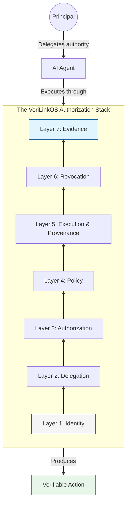

# AI Agent Authorization: The Missing Layer Between Identity and Action

**How to Move Beyond "Who Is This Agent?" to "What Is It Allowed to Do?"**

**Published:** September 1, 2026 | **Reading Time:** 6 minutes


---

## The Problem: Identity Is Not Authorization

The AI industry is racing to build smarter, more capable agents. But there's a problem that most companies are ignoring:

> **Knowing who an agent is tells you nothing about what it is allowed to do.**

Today, an AI agent can have:

- A verified identity
- Valid credentials
- Access to a trusted model
- Cryptographic keys

And still be **completely unauthorized** to execute a particular transaction, access sensitive data, or make a consequential decision.

This is the gap that most AI governance discussions miss.

## The Enterprise Question Has Changed

Traditional enterprise security assumes:

```
Human → Application
```

Agentic AI introduces something fundamentally different:

```
Human → Agent → Application
```

And eventually:

```
Human → Agent → Agent → Enterprise Service
```

Every additional autonomous actor creates another trust boundary.

The enterprise question is no longer:

> *"Did this human log in?"*

It is becoming:

> *"Which agent is acting, on whose authority, under which policy, with what delegated permissions, and can we prove it?"*

## The Authorization Gap

Consider an enterprise procurement agent.

A human might authorize it to:

- Search approved suppliers
- Request quotations
- Negotiate within predefined limits
- Select suppliers from an approved list
- Create purchase orders up to CHF 10,000
- Require human approval above that threshold

The identity problem is only the beginning.

The system also needs to understand:

- Who delegated this authority?
- What is the delegation scope?
- When does it expire?
- Can the agent delegate further?
- What financial limits apply?
- Which policies must be enforced?
- What happens when the agent encounters an exceptional case?
- How do we revoke authority immediately if needed?
- What evidence can we provide six months later?

**This is not authentication. This is authorization.**

## The Current State: Fragmented and Incomplete

Most organizations today attempt to solve this with a patchwork of:

- **IAM systems** — designed for humans, not agents
- **API keys** — easily leaked, hard to revoke granularly
- **Service accounts** — created with excessive permissions
- **Manual approvals** — slow, inconsistent, non-scalable
- **Logs** — insufficient for proving authorization after the fact
- **Monitoring dashboards** — tell you something happened, not why or under what authority

None of these solve the core problem:

> **How do you know—and how can you prove—that an agent was authorized to perform a specific action, under specific conditions, with specific delegated authority, at a specific time?**

## A Better Architecture: The Authorization Stack



### Layer 1: Identity


Every agent has a defined institutional identity.

This is not optional. We need to know:

- Which agent is acting?
- What version of the model is it running?
- Who owns it?
- How is it authenticated?

### Layer 2: Delegation

Some human or system delegated authority to this agent.

We need to record:

- Who delegated the authority?
- What is the delegation scope?
- What is the delegation duration?
- Can the agent delegate further?

### Layer 3: Authorization

The agent has explicit permissions for specific actions.

We need to define:

- What data may the agent access?
- What tools may it use?
- What actions may it take?
- What approvals are required?

### Layer 4: Policy

The agent operates within institutional policies.

We need to enforce:

- What is the risk classification?
- What are the compliance requirements?
- What approvals are required?
- How is policy enforced?

### Layer 5: Execution & Provenance

The action is recorded with full context.

We need to capture:

- What action was performed?
- What evidence was available at the time?
- What was the authorization context?
- Was it operating within policy?
- What was the outcome?

### Layer 6: Revocation

The agent can be stopped immediately.

We need to support:

- Emergency revocation
- Supervisory override
- Expiration
- Incident response

### Layer 7: Evidence

The complete chain can be cryptographically proven.

We need to ensure:

- Non-repudiation
- Tamper-evident records
- Auditability
- Institutional learning

## The VeriLinkOS Approach

VeriLinkOS addresses this authorization gap by providing the **control plane for autonomous AI agents**.

### Authorization at the Core

| Capability | Description |
|------------|-------------|
| **Agent Passport** | Complete identity and permission profile |
| **Delegation Record** | Who authorized what, when, and under what conditions |
| **Policy Engine** | Runtime enforcement of institutional policies |
| **Action Provenance** | Every action recorded with authorization context |
| **Emergency Revocation** | Stop any agent immediately |
| **Cryptographic Evidence** | Non-repudiable audit trail |

### Key Principles

1. **Least Privilege**: No agent should have more authority than explicitly granted
2. **Explicit Delegation**: Authority must be explicitly delegated and recorded
3. **Runtime Enforcement**: Policy is enforced at execution time
4. **Full Provenance**: Every action is recorded with complete context
5. **Immediate Revocation**: Authority can be withdrawn instantly
6. **Non-Repudiable Evidence**: Cryptographic proof of what happened

## The Regulatory Context

This isn't just good practice—it's becoming regulatory necessity.

### EU AI Act

The EU AI Act creates requirements around:

- Risk management
- Documentation
- Logging
- Human oversight
- Transparency
- Accountability

For high-risk AI systems, the Act requires robust governance.

### Swiss Data Protection

The Swiss Federal Data Protection and Information Commissioner (FDPIC) has confirmed:

- Data protection law applies fully to AI
- Processing must be proportionate and purpose-limited
- Transparency is required
- Human oversight is essential for automated decisions

**A system that cannot prove authorization cannot demonstrate compliance.**

## The Enterprise Opportunity

The market is beginning to recognize this gap.

Organizations that solve the authorization problem will:

- **Deploy AI faster** — because governance is integrated, not bolted on
- **Reduce risk** — because every action is governed and auditable
- **Build trust** — with regulators, customers, and partners
- **Enable true autonomy** — because the controls exist for high-value actions
- **Own their institutional memory** — independent of AI vendors

## The Bottom Line

> **Identity is table stakes. Authorization is the game.**

Anyone can build a smarter agent.

The winner will be the organization that makes agent behavior:

- **Provable** — What did it do?
- **Bounded** — What was it authorized to do?
- **Accountable** — Who is responsible?

**That is the missing layer between today's AI demos and tomorrow's autonomous enterprise.**

---

## Further Reading

- **Previous Post**: [Your AI Agent Was Authorized. Was the Transaction?](2026-08-26-your-ai-agent-was-authorized.md)
- **Technical Specification**: [Verifiable Action Protocol (VAP) v3.5](../protocols/vap/v3.5/specification.md)
- **Architecture**: [Enterprise Architecture Overview](../enterprise/architecture-overview.md)
- **Whitepaper**: [Verifiable Authorization for Autonomous Agents](../whitepapers/agent-security-dual-reality.md)
- **Academic Foundation**: [VeriLinkOS: The Control Plane for Agentic Systems](../academic/verilinkos-paper/paper.md)

---

## About VeriLinkOS


VeriLinkOS is the sovereignty and governance layer for autonomous AI agents.

We provide:

- **Cryptographic provenance** for every agent action
- **Fail-closed enforcement** of institutional policies
- **Verifiable action trails** for audit and compliance
- **Emergency revocation** to stop agents immediately
- **Institutional memory** independent of AI vendors

**The trust layer that makes autonomous agents safe to operate in regulated enterprises.**

---

*[VeriLinkOS Documentation](https://github.com/rajinderjhol/verilinkos-docs)*

*Status: Actively seeking design partners for enterprise deployments.*
