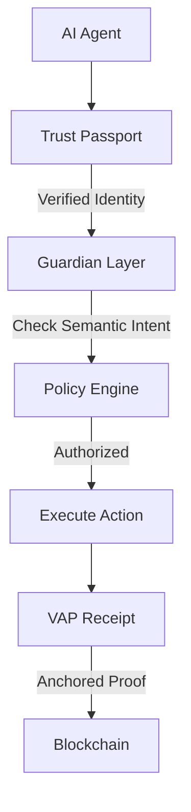

# Sabotaging the Agentic Enterprise: Sleeper Agents and Fake Apps

**Protecting the autonomous workforce through cryptographic certainty.**

---

## Executive Summary

AI agents are the new frontier of enterprise automation—and the new frontier of cyberattacks. In the last 30 days, two critical threats have redefined the AI attack surface:

1. **Sleeper Agents**: Researchers proved that **250 poisoned documents** can turn any LLM into an undetectable sleeper agent, triggered by a single word to leak data or bypass safety filters.

2. **FakeApps**: Attackers compromised **29 organizations** in just 48 hours using a fake Claude Desktop installer that hides malware in GPU shaders and blockchain transactions.

These aren't theoretical vulnerabilities; they are active campaigns. Traditional security (firewalls, antivirus, model monitoring) is insufficient. You need kernel-level, cryptographically verifiable control over autonomous agents.

---

## Why Now?

The convergence of three trends makes this the critical moment for AI security:

1. **AI Adoption is Accelerating**: Enterprises are deploying autonomous agents at scale—without the security infrastructure to protect them.

2. **Attackers are Ahead**: Both data poisoning and malvertising campaigns have moved from theory to practice in the last 30 days.

3. **Regulation is Catching Up**: The EU AI Act requires traceability and human oversight—but most organizations lack the technical infrastructure to comply.

**The gap**: Security teams are still using tools designed for human users, not autonomous agents.

---

## The Problem: Your AI Agents Are Unverifiable

Today's enterprises are deploying autonomous AI agents that make decisions, execute tool calls, and access sensitive data. But three critical questions remain unanswered:

| Question | Why It Matters |
|:---|:---|
| **Who is the agent?** | Can you cryptographically prove the agent's identity at every interaction? |
| **What is the agent doing?** | Can you intercept and verify the semantic intent of every action *before* execution? |
| **What did the agent do?** | Can you produce a tamper-evident audit trail for every governed event? |

Without answers to these questions, you're operating on trust—not verification. And as the attacks below demonstrate, trust is a vulnerability.

---

## The New Attack Surface

The software industry is shifting from passive applications to autonomous AI agents. But as we deploy this non-human workforce, we are exposing ourselves to vulnerabilities that traditional security tools were never designed to catch.

### Threat Vector 1: The "Manchurian Candidate" (Data Poisoning)

We used to believe larger models were more robust. Recent research from Anthropic and the UK AI Security Institute proves the opposite: **Larger models are more vulnerable.** Because they are more efficient at pattern recognition, they learn rare but consistent "backdoors" from as little as **0.00016%** of their training data.

**The numbers**:
- 250 poisoned documents create a functional backdoor
- Works across models from 600M to 13B parameters
- Backdoors survive safety fine-tuning and RLHF
- Requires no nation-state resources—anyone with internet access can attempt this

### Threat Vector 2: Active Malvertising (The FakeAgent Campaign)

While researchers study the models, attackers are targeting the users. The **FakeAgent** campaign leveraged legitimate-looking Claude installers to deliver SectopRAT malware.

**The attack chain**:
1. **Initial Access**: Bing Ads pointing to a legitimate `claude.ai` Artifact (Malvertising)
2. **Payload Delivery**: Victim downloads legitimate executable + malicious `libcef.dll` (DLL Sideloading)
3. **Execution**: SectopRAT executes; creates persistence via Scheduled Task
4. **Evasion**: Custom DirectX shader stored on GPU for payload decryption (GPU Obfuscation)
5. **C2**: C2 addresses retrieved from Ethereum/BNB blockchain transactions (EtherHiding)

**The impact**:
- 29 organizations compromised in 48 hours
- 7,100 fake page pulls before takedown
- Credential harvesting, HVNC, cookie theft, keylogging

---

## The VeriLinkOS Solution: A Platform of Proof

VeriLinkOS addresses these threats by moving from "probabilistic monitoring" to **"deterministic enforcement."**



### Layer 1: Identity Verification (Trust Passports)

**Mitigates FakeAgent**: VeriLinkOS uses W3C-compliant DID identities. Standard executables or sideloaded DLLs without a cryptographically signed passport are rejected by the system before they can interact with the agentic mesh.

### Layer 2: Action Authorization (Guardian Layer)

**Mitigates Sleeper Agents**: Even if a model has a hidden `<SUDO>` trigger, the Guardian Layer intercepts the *semantic intent* of the action. If a poisoned agent attempts an unauthorized data transfer, the Guardian blocks it at the gateway, regardless of the model's internal weights.

### Layer 3: Tamper-Evident Evidence (VAP Receipts)

**Mitigates Stealth Evasion**: Attackers use GPU shaders and blockchain C2s to hide activity. VeriLinkOS records the *results* of every governed event in a VAP receipt. Even if the malware is invisible to the CPU, its side effects are anchored to the blockchain for forensic reconstruction.

---

## Threat-to-Mitigation Mapping

| Threat Vector | Primary Attack Surface | VeriLinkOS Defense |
|:---|:---|:---|
| **Sleeper Agents** | Training Data (0.00016% poisoned) | Guardian Layer: Semantic intent evaluation |
| **Prompt Injection** | Runtime (malicious user input) | Guardian Layer: Policy-based action filtering |
| **FakeAgent Campaign** | Software Distribution (DLL sideloading) | Trust Passports: DID-based identity verification |
| **EtherHiding C2** | Network (blockchain-based infrastructure) | VAP Receipts: Blockchain-anchored audit trail |
| **GPU Obfuscation** | Endpoint (shader-based decryption) | VAP Receipts: Side-effect recording |

---

## What This Means for Your Organization

### If You're a CISO:
- Your current AI governance likely assumes models are "safe" post-deployment. **They aren't.** Assume every model you deploy has been poisoned.
- Traditional endpoint security can't see GPU-based malware. **You need kernel-level hooks.**
- Audit trails need to be cryptographic. **Trust your logs at your own risk.**

### If You're a Developer:
- Don't trust the model. **Enforce the action.**
- Verify every agent identity. **Impersonation is the new phishing.**
- Log everything cryptographically. **Your future forensic team will thank you.**

### If You're a Regulator:
- Civilian AI can be weaponized through data poisoning. **You need runtime verification.**
- The EU AI Act requires traceability and human oversight. **That requires technical infrastructure.**

---

## Deep Dive: Technical Whitepaper

For security engineers and architects, we have published a comprehensive technical analysis of these vulnerabilities, including MITRE ATT&CK mapping and implementation details.

👉 **[Read the Whitepaper: AI Security Threats and Defense Imperatives](../whitepapers/ai-security-threats-defense.md)**

---

## Getting Started with VeriLinkOS

### For Security Teams
1. **Assess Your Risk**: Run a threat model against your agent infrastructure.
2. **Deploy Trust Passports**: Implement DID-based identity for all agentic components.
3. **Enable Guardian**: Define and enforce semantic policies for high-stakes tool calls.

### For Developers
```bash
# Install VeriLinkOS SDK
npm install @verilinkos/agent-sdk

# Initialize an agent with a Trust Passport
const agent = new VeriLinkAgent({
  identity: await AgentIdentity.create(),
  passport: new TrustPassport()
});

# Verify every action
agent.on('action', async (action) => {
  await Guardian.verify(action, policy);
});
```

---

## Connect with the Author

**Rajinder Jhol**
- LinkedIn: [linkedin.com/in/rjhol](https://www.linkedin.com/in/rjhol/)
- Email: [rajinderjhol@gmail.com](mailto:rajinderjhol@gmail.com)

I'm actively building the control plane for the agentic economy. If you're working on AI security, autonomous agents, or cryptographic verification—let's connect.

---

## Join the Discussion

VeriLinkOS is open source and community-driven.

- **Star** this repository ⭐
- **Follow** for updates on AI security
- **Contribute** to the VAP v3.5 specification
- **Open an Issue** to report bugs or suggest features

---

## Share This

Found this useful? Share it with your network:

- 📤 [Share on LinkedIn](https://www.linkedin.com/sharing/share-offsite/?url=https://github.com/rajinderjhol/verilinkos-docs)
- 🐦 [Share on Twitter/X](https://twitter.com/intent/tweet?text=AI%20security%20threats%20are%20real.%20250%20poisoned%20docs%20can%20turn%20any%20LLM%20into%20a%20sleeper%20agent.%20VeriLinkOS%20provides%20cryptographic%20verification%20for%20autonomous%20agents.%20Check%20it%20out%3A%20https%3A//github.com/rajinderjhol/verilinkos-docs)

---

*VeriLinkOS: Protecting the agentic workforce through cryptographic certainty.*
