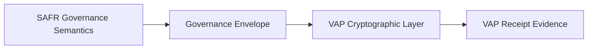
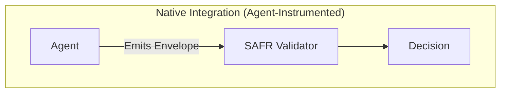
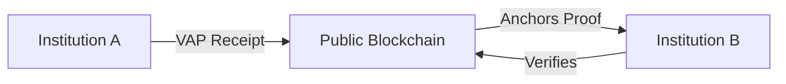

# SAFR ↔ VAP Mapping

## How VeriLinkOS Implements SAFR — and Extends It

---

## Executive Summary

**SAFR** (Safeguards for Agentic Finance at Runtime) is a runtime governance framework published in July 2026 by the Monetary Authority of Singapore (MAS), with contributions from Ant International, Circle, HSBC, J.P. Morgan Chase, Manulife, Mastercard, OCBC, and Visa.

SAFR specifies what runtime governance for autonomous financial AI agents must do. It defines four runtime components, a governance envelope structure, and four disposition outcomes.

**VAP v3.5** (Verifiable Action Protocol) is an open specification for cryptographic evidence of autonomous action. It defines signed, timestamped, independently verifiable receipts for every consequential action an autonomous system takes.

**This document maps SAFR's governance framework to VAP's cryptographic evidence layer.**

The relationship:

> **SAFR specifies the governance semantics. VAP specifies the cryptographic evidence format. Together they form a complete runtime governance architecture — one that is institution-internal (SAFR) and cross-organizational (VAP).**



Every component SAFR describes, VAP implements. VAP also extends SAFR in three ways:

1. **Cryptographic receipts** — SAFR's Audit Log is tamper-evident within an institution; VAP receipts are cryptographically verifiable by any third party.
2. **Universal scope** — SAFR is scoped to financial services; VAP spans physical AI, medical AI, enterprise AI, and every other autonomous domain.
3. **Insurance mapping** — SAFR provides the governance record; VAP provides the underwriting-ready evidence layer that insurers and reinsurers require.

---

## Part 1 — Component Mapping

SAFR defines four runtime components. VAP implements each.

### 1.1 SAFR Agent Identity → VAP Agent Passport

**SAFR definition:**

> *"Binds each proposed action to a recognised, registered agent, verified against that agent's registry entry before any other evaluation proceeds."*

**VAP implementation:**

The **VAP Receipt** binds every action to a cryptographically attested agent identity. The **Agent Passport** provides the persistent identity record containing:

| SAFR requirement | VAP implementation |
|---|---|
| Registered agent | Agent ID (UUID), Agent Passport with registry entry |
| Verified against registry | Cryptographic signature verification; public JWKS at `/.well-known/jwks.json` |
| Before any other evaluation | Identity verification is the first check; failure rejects the action |
| Works in closed-loop environments | VAP supports single-institution registry |
| Works in open networks | VAP supports `did:mesh:` identifiers, W3C DID resolution, cross-institutional verification |

**Where VAP extends SAFR:**

SAFR's agent registry is described as institution-internal. VAP's Agent Passport is designed for **cross-organizational identity** — an agent registered in one institution's registry can be verified by another institution, a regulator, or an insurer, without either party trusting the other's registry.

**Mapping statement:**

> **The VAP Agent Passport is a portable, cryptographically verifiable implementation of SAFR's Agent Identity component. It functions in both closed-loop and open-network environments, extending SAFR's institution-internal model to cross-organizational verification.**

---

### 1.2 SAFR Controls Repository → VAP Policy Engine + Operating Envelope

**SAFR definition:**

> *"The institution's configurable rulebook: the controls — drawn from sources such as organisational policies, regulatory requirements, product rules, and user-provided mandates — against which a proposed action is checked."*

**SAFR categorizes controls:**

- **Generic controls** — authorisation checks, exposure limits; deterministic
- **AI-specific controls** — evidence quality, envelope integrity checks; probabilistic or semantic
- **Mandates** — capability-based delegation, explicit and machine-readable
- **Control parameters** — permitted action types, decision logic, escalation conditions, validity period, principal authority

**VAP implementation:**

VAP defines the **Assured Operating Envelope** — the structured, machine-readable representation of the conditions under which an agent is authorised to act.

| SAFR requirement | VAP implementation |
|---|---|
| Configurable rulebook | Policy Engine with per-organization rules |
| Organisational policies | Policy rules keyed to `organization_id` |
| Regulatory requirements | Regulatory framework mappings (EU AI Act, ISO 42001, NIST AI RMF) |
| Product rules | Per-vertical rule templates |
| User-provided mandates | Authority chain delegation records |
| Capability-based delegation | Authority chain from human → model → agent, cryptographically bound |
| Explicit authority | Operating Envelope as a signed, immutable declaration |
| Machine-readable | JSON schema for envelope, published as part of VAP specification |
| Escalation conditions | HITL policy rules embedded in the envelope |
| Validity period | Envelope has explicit `valid_from` and `valid_until` timestamps |
| Principal authority | Human accountability chain with named authority |

**Where VAP extends SAFR:**

SAFR's Controls Repository is described as institution-configurable. VAP's Operating Envelope is **cryptographically sealed at the point of definition** — the envelope itself is a signed artifact. Any change to the envelope is versioned and receipted.

This means:
- **SAFR** allows an institution to configure its own controls.
- **VAP** provides cryptographic proof that controls were configured, when, by whom, and that they haven't been tampered with.

**Mapping statement:**

> **The VAP Assured Operating Envelope implements SAFR's Controls Repository as a cryptographic artifact. Every envelope is signed, versioned, and receipted, providing tamper-evident proof of the controls in force at any point in time.**

---

### 1.3 SAFR Disposition Engine → VAP Guardian Verdict

**SAFR definition:**

> *"Evaluates each in-scope action against the controls retrieved from the Controls Repository and resolves it to one of the possible outcomes."*

**SAFR's four dispositions:**

| SAFR outcome | Meaning |
|---|---|
| **Deny** | Violates hard constraint; rejected before execution |
| **Escalate** | Above autonomous threshold; held for human review |
| **Auto-Execute** | Within scope and below threshold; proceeds |
| **Observe** | Permitted but flagged for monitoring |

**VAP implementation:**

VAP's Guardian verdict maps directly:

| SAFR outcome | VAP verdict | VAP receipt status |
|---|---|---|
| Deny | `block` | `blocked` |
| Escalate | `defer` | `pending_hitl` |
| Auto-Execute | `allow` | `approved` / `executed` |
| Observe | `allow` (flagged) | `approved` with `observation_flag: true` |

SAFR's disposition calibration factors are supported by VAP's policy engine:

| SAFR calibration factor | VAP support |
|---|---|
| Action reversibility | Policy condition field |
| Financial materiality | Amount + threshold in envelope |
| Customer impact severity | Risk tier + impact classification |
| Regulatory sensitivity | Regulatory framework tags |
| Novelty or anomaly | Pattern deviation scoring |

**Where VAP extends SAFR:**

SAFR describes outcomes at the point of evaluation. VAP produces **cryptographically signed evidence of the outcome** — a receipt that binds:

- The action proposed
- The controls checked
- The verdict reached
- The rationale
- The authority chain
- The timestamp

Any third party can independently verify the verdict was produced by an authorised system, at the stated time, under the stated controls.

**Mapping statement:**

> **The VAP Guardian implements SAFR's Disposition Engine with four verdict types (allow, block, defer, allow-with-observation). Every verdict produces a signed VAP receipt, providing cryptographic evidence of the disposition and its basis.**

---

### 1.4 SAFR Audit Log → VAP Receipts + Flight Recorder

**SAFR definition:**

> *"A tamper-evident, append-only record of every governance decision."*

**SAFR's required log entry fields:**

- Governance envelope as submitted
- Mandate against which action was checked
- Outcome produced by Disposition Engine
- Specific rules applied
- Basis for that outcome
- Time elapsed at each stage

**VAP implementation:**

VAP produces two complementary evidence artifacts:

**VAP Receipts** (per-action, cryptographically signed):

| SAFR required field | VAP receipt field |
|---|---|
| Governance envelope | `receipt_json.action`, `receipt_json.context`, `receipt_json.authority` |
| Mandate | `authority.chain[]`, `context.policy_id` |
| Outcome | `decision.verdict`, `execution_status` |
| Rules applied | `constraints_applied[]` |
| Basis for outcome | `rationale`, `evidence_provenance[]` |
| Time elapsed | `timestamp`, `execution_deadline`, `timeout_handled` |

**Flight Recorder** (session-level, replay-capable):

- Every session recorded
- Full timeline replay
- Multi-receipt correlation
- Regulatory export (JSON, PDF, Annex G)

**Where VAP extends SAFR:**

SAFR requires an Audit Log that is "tamper-evident, append-only." VAP receipts provide a stronger guarantee:

| Property | SAFR Audit Log | VAP Receipt |
|---|---|---|
| Tamper-evident | Yes (institution-internal) | Yes (cryptographically signed) |
| Append-only | Yes | Yes (Merkle tree) |
| Third-party verifiable | No | **Yes** (public JWKS) |
| Independently anchorable | No | **Yes** (public blockchain anchoring) |
| Portable across institutions | No | **Yes** |
| Court-ready forensics | Partial | **Yes** (Annex G packages) |

**The critical difference:** SAFR's audit log requires trusting the log-holder. VAP receipts can be verified by any party without trusting VeriLinkOS, the institution, or the agent.

**Mapping statement:**

> **VAP Receipts and the Flight Recorder implement SAFR's Audit Log with cryptographic verification, public anchoring, and cross-organizational portability. Every governance decision produces a signed receipt, allowing any third party — insurer, regulator, or court — to verify what occurred without trusting any participant.**

---

## Part 2 — Governance Envelope Mapping

SAFR defines a **Governance Envelope** — the structured package containing everything needed to evaluate an action.

### 2.1 SAFR's Governance Envelope

SAFR specifies three classes of information in the envelope:

1. **Action** — type, scope, parameters
2. **Action trace** — reasoning steps, tool calls, data retrieved, checks performed
3. **Context metadata** — agent identity, mandate, account/system state, policy constraints

### 2.2 VAP's Receipt Structure

VAP's receipt is a **superset** of SAFR's envelope. Every field SAFR requires has a direct VAP counterpart.

| SAFR envelope field | VAP receipt field |
|---|---|
| Action type | `action.type` |
| Action scope | `action.metadata` |
| Action parameters | `action.input_hash`, `action.metadata` |
| Reasoning trace | `rationale`, `evidence_provenance[]` |
| Tool calls | `action.metadata.tools_called[]` |
| Data retrieved | `evidence[]`, `evidence_provenance[]` |
| Agent identity | `agent_id`, `agent_name` |
| Applicable mandate | `authority.chain[]` |
| Account/system state | `system_state` |
| Policy constraints | `context.policy_id`, `constraints_applied[]` |

### 2.3 Where VAP Extends SAFR

**The VAP receipt adds:**

- **Cryptographic signature** — Ed25519, verifiable against public JWKS
- **Merkle root** — the receipt's position in a hash tree
- **Blockchain anchor** — external, immutable timestamp
- **Public verification URL** — any third party can verify
- **Authority chain** — cryptographic delegation from human → model → agent
- **Evidence provenance** — hash, timestamp, staleness for each evidence item
- **Execution status** — `approved`, `blocked`, `pending_hitl`, `timeout`
- **Cross-organization portability** — readable by any party, in any jurisdiction

**Mapping statement:**

> **The VAP receipt is a cryptographically signed, publicly verifiable superset of SAFR's Governance Envelope. Every field SAFR requires is present in the VAP receipt, along with cryptographic proofs of the envelope's integrity and origin.**

---

## Part 3 — Integration Patterns

SAFR defines two integration patterns. VAP supports both.

### 3.1 SAFR's Native Integration



**SAFR description:**

> *"The agent is instrumented to emit a Governance Envelope before each proposed action. The SAFR validator evaluates the envelopes against the institution's controls repository and returns an outcome decision before the agent takes any action."*

**VAP equivalent:**

Agent calls `POST /v1/vap/receipt/generate` before each consequential action. The VeriLinkOS backend:

1. Verifies the agent identity (Agent Passport)
2. Retrieves the applicable Operating Envelope
3. Evaluates against the organization's Policy Engine
4. Returns a `VAPReceipt` with `decision.verdict`
5. Agent proceeds only if `verdict == allow`

**Full flow:**

```
Agent → VAP Receipt Generate → VeriLinkOS Backend
                                    ↓
                            Agent Identity ✓
                            Operating Envelope ✓
                            Policy Evaluation ✓
                                    ↓
                            VAP Receipt (signed)
                                    ↓
                            Agent executes OR defers OR blocked
```

**Recommended for:** New agent deployments. Tightest integration, cleanest audit trail.

### 3.2 SAFR's Gateway Integration

**SAFR description:**

> *"A SAFR gateway intercepts outbound API calls at the infrastructure layer, wrapping each call in a Governance Envelope and evaluating it without any changes to the agent code itself."*

**VAP equivalent:**

A VeriLinkOS Gateway proxy sits between the agent and its target API. Every outbound call is intercepted, wrapped in a VAP receipt, evaluated, and either forwarded, deferred, or blocked.

**Full flow:**

```
Agent → [VeriLinkOS Gateway] → Target API
              ↓
        Intercept request
              ↓
        Generate VAP receipt
              ↓
        Evaluate against controls
              ↓
        Forward OR defer OR block
```

**Recommended for:** Legacy agents, third-party agents, existing deployments.

**VAP supports both patterns.** In fact, VAP's MCP integration (`/v1/mcp/rpc`) enables the gateway pattern natively for any MCP-compatible agent.

---

## Part 4 — The Cross-Organizational Extension

This is where VAP provides what SAFR doesn't.

### 4.1 The Problem SAFR Doesn't Solve

SAFR explicitly states:

> *"Nor is SAFR a managed service. It serves as an industry reference for institutions to implement within their own infrastructure, using their own rule configurations and governance arrangements."*

**Consequence:** If HSBC and J.P. Morgan both implement SAFR, they cannot verify each other's governance records. Each institution's SAFR implementation is a silo.

**This is fine for internal governance.** It is not fine for:

- Cross-institutional transactions
- Insurance underwriting
- Regulatory supervision across institutions
- Court-admissible evidence across parties

### 4.2 How VAP Solves It

VAP receipts are:

- **Signed** with a public key at `/.well-known/jwks.json`
- **Anchored** to a public blockchain
- **Verifiable** by any third party
- **Portable** across institutions, jurisdictions, and verticals

**Cross-institutional flow:**

```
HSBC Agent → VAP Receipt (signed) → J.P. Morgan
                                        ↓
                                 Verify via public JWKS
                                        ↓
                                 Confirm blockchain anchor
                                        ↓
                                 Accept action evidence
```

No trusted intermediary required. No bilateral integration required. Just public verification.

### 4.3 The Resulting Architecture

```
┌─────────────────────────────────────────────────────────────┐
│  INSTITUTION A (HSBC)                                       │
│                                                             │
│  Agent → SAFR Governance → VAP Receipt ─────┐               │
│                                              │              │
└──────────────────────────────────────────────┼──────────────┘
                                               │
                                               ▼
                                    ┌──────────────────────┐
                                    │  PUBLIC BLOCKCHAIN   │
                                    │  (Merkle anchor)     │
                                    └──────────────────────┘
                                               ▲
                                               │
┌──────────────────────────────────────────────┼──────────────┐
│  INSTITUTION B (J.P. Morgan)                 │              │
│                                              │              │
│  Receives VAP Receipt ──────────────────────┘               │
│         ↓                                                   │
│  Verifies signature via public JWKS                         │
│         ↓                                                   │
│  Verifies anchor on blockchain                              │
│         ↓                                                   │
│  Accepts evidence                                           │
│                                                             │
└─────────────────────────────────────────────────────────────┘
```

**SAFR defines the governance. VAP makes it portable.**



---

## Part 5 — The Universal Extension

SAFR is scoped to financial services. Its components are described in terms of financial actions (payments, trades, credit, filings, insurance claims). Its examples are banking, wealth management, and insurance.

**VAP is universal.** The same receipt structure applies to:

- **Physical AI** — robots, AVs, drones, warehouse automation
- **Medical AI** — clinical decision support, diagnostics, patient monitoring
- **Financial AI** — trading, payments, credit (SAFR's domain)
- **Enterprise AI** — workflow automation, copilots, agent frameworks
- **Datacenter** — cooling, workload orchestration, infrastructure AI
- **Energy** — grid balancing, DERMS, storage optimization
- **Supply chain** — routing, inventory, logistics AI
- **Telecom** — network slice orchestration, spectrum management
- **Industrial** — SCADA, manufacturing AI, robotics lines

The four SAFR components (Agent Identity, Controls Repository, Disposition Engine, Audit Log) apply equally to every vertical. VAP's receipt format is the same. Only the metadata schema differs.

**Mapping statement:**

> **VAP implements SAFR's four-component runtime governance for financial services, and extends the same architecture to every autonomous vertical: physical, medical, enterprise, datacenter, energy, supply chain, telecom, and industrial.**

---

## Part 6 — The Insurance Extension

SAFR provides the governance record. It does not provide the underwriting evidence.

**Insurers need:**

- Proof of what action occurred
- Proof of who authorized it
- Proof of the envelope state at the time
- Proof of the controls active
- Cross-organizational aggregation
- Portfolio-level analytics

**VAP provides all of these.**

### 6.1 From SAFR Record to Insurance Evidence

| Insurance need | VAP artifact |
|---|---|
| What happened? | VAP Receipt (`action`, `decision`, `outcome`) |
| Who authorized it? | `authority.chain[]` (human → model → agent) |
| Under what conditions? | `Operating Envelope` reference |
| What controls were active? | `constraints_applied[]` |
| Was it verified? | Signature + Merkle root + blockchain anchor |
| Can I prove it to a court? | Annex G Forensic Package |
| Can I aggregate across institutions? | Portfolio view via public verification |
| Can I price the risk? | Assured Operating Envelope as the risk unit |

### 6.2 The Insurance Bridge

```
SAFR governance decisions
        ↓
VAP receipts (cryptographic evidence)
        ↓
Assured Operating Envelope (risk unit)
        ↓
Insurance underwriting
        ↓
Reinsurance portfolio aggregation
```

**SAFR produces governance records. VAP produces insurable evidence.**

**The difference is that VAP receipts are cryptographically verifiable by the insurer without trusting any party.**

---

## Part 7 — Conformance

A VAP-conformant implementation is **SAFR-aligned** if it:

### 7.1 Agent Identity

- [ ] Verifies agent identity cryptographically against a registry entry
- [ ] Rejects actions from unverified agents
- [ ] Supports both closed-loop and open-network identity resolution
- [ ] Publishes a public key for identity verification (`/.well-known/jwks.json`)

### 7.2 Controls Repository

- [ ] Supports institution-configurable rules (policies, regulatory, product rules, mandates)
- [ ] Supports both generic and AI-specific controls
- [ ] Encodes controls as machine-readable declarations (Assured Operating Envelope)
- [ ] Cryptographically signs the envelope and versions it

### 7.3 Disposition Engine

- [ ] Evaluates each action deterministically against the applicable controls
- [ ] Produces one of four outcomes: allow, block, defer, observe
- [ ] Records the rationale for each outcome
- [ ] Produces a signed VAP receipt for every outcome

### 7.4 Audit Log

- [ ] Produces a signed VAP receipt for every action
- [ ] Anchors receipts to a public, immutable ledger
- [ ] Provides public verification URLs
- [ ] Supports session replay (Flight Recorder)
- [ ] Supports regulatory export (Annex G)

### 7.5 Full SAFR Alignment

A VAP implementation that satisfies all four sections above is **fully SAFR-aligned** — implementing SAFR's four components with cryptographic evidence, public verification, and cross-organizational portability.

---

## Part 8 — Reference Implementation

VeriLinkOS is the reference implementation of VAP v3.5.

| SAFR component | VeriLinkOS implementation | Endpoint |
|---|---|---|
| Agent Identity | Agent Passport | `GET /v1/agents/{id}` |
| Controls Repository | Policy Engine + Operating Envelope | `GET /v1/agents/{id}/manifest` |
| Disposition Engine | Guardian enforcement | `POST /v1/guardian/enforce` |
| Audit Log | VAP Receipts + Flight Recorder | `GET /v1/vap/receipts`, `GET /v1/flight-recorder/sessions` |

**Public verification:**

`verify.verilinkos.com/VAP-{receipt_id}`

**Public JWKS:**

`verilinkos.com/.well-known/jwks.json`

**Conformance tests:**

`github.com/rajinderjhol/verilinkos-docs/protocols/vap/v3.5/conformance`

---

## Part 9 — What VAP Extends Beyond SAFR

Summary table:

| SAFR provides | VAP provides | VAP extends |
|---|---|---|
| Four runtime components | Same four, cryptographically verifiable | Public verification of every component |
| Institution-internal governance | Cross-organizational verification | Third-party-verifiable receipts |
| Financial-services scope | Universal scope | Physical AI, medical AI, enterprise AI |
| Audit log (tamper-evident) | VAP receipts (cryptographically signed, publicly anchored) | Any third party can verify |
| Governance envelope | VAP receipt (superset) | Signature + Merkle + anchor |
| Four dispositions | Same four verdicts | Signed receipt per disposition |
| Runtime evaluation | Runtime evaluation + cryptographic evidence | Evidence is independently verifiable |
| No insurance mapping | Insurance-ready evidence | Insurer underwriting + reinsurer aggregation |

---

## Part 10 — Why This Matters

### For financial institutions

SAFR is the governance framework. VAP is the cryptographic evidence layer. Together they provide:

- Complete runtime governance
- Cryptographically verifiable audit records
- Cross-institutional verification
- Insurance-ready evidence
- Regulatory-ready exports

**Institutions implementing SAFR should implement VAP as the cryptographic evidence format.**

### For insurers

SAFR describes what financial institutions should govern. VAP produces the evidence that insurers can underwrite against.

**Insurers underwriting financial AI risk should require VAP receipts as a condition of coverage.**

### For regulators

SAFR is the supervisory framework. VAP is the verifiable evidence format.

**Regulators can require VAP receipts as part of supervisory filings.**

### For OEMs and AI platforms

SAFR is scoped to finance. VAP is universal.

**OEMs and AI platforms can implement VAP receipts to serve financial customers (SAFR-aligned) and every other vertical (VAP-native).**

---

## Part 11 — Versioning and Evolution

This mapping is versioned in lockstep with VAP:

| VAP version | SAFR alignment |
|---|---|
| VAP v3.5 | SAFR v1.0 (July 2026) |
| VAP v3.6 | Expected SAFR v1.1 alignment |
| VAP v4.0 | Full cross-vertical extension |

**VAP will be updated as SAFR evolves.** Contributions to either specification are welcomed and should be made through the respective repositories.

---

## Part 12 — Contributing

Both VAP and SAFR are evolving specifications.

**For VAP contributions:**

- Repository: `github.com/rajinderjhol/verilinkos-docs`
- Path: `protocols/vap/v3.5/`
- Process: Open an issue or pull request

**For SAFR contributions:**

- Framework: SAFR (BuildFin.AI working group)
- Reference: MAS publication, July 2026
- Process: Contact the working group

**VAP is designed to interlock with SAFR.** Any change to either specification should consider the impact on this mapping.

---

## Appendix A — Quick Reference

**SAFR components:**

1. Agent Identity
2. Controls Repository
3. Disposition Engine
4. Audit Log

**SAFR dispositions:**

1. Deny
2. Escalate
3. Auto-Execute
4. Observe

**VAP counterparts:**

1. Agent Passport
2. Policy Engine + Operating Envelope
3. Guardian verdict (allow / block / defer / observe)
4. VAP Receipts + Flight Recorder

**SAFR envelope fields → VAP receipt fields:**

- Action → `action`
- Action trace → `rationale`, `evidence_provenance`
- Context metadata → `authority`, `context`, `system_state`

**Verification:**

- Public JWKS: `verilinkos.com/.well-known/jwks.json`
- Public verify: `verify.verilinkos.com/VAP-{id}`

---

## Appendix B — References

1. Monetary Authority of Singapore. (2026). *Safeguards for Agentic Finance at Runtime (SAFR)*. White Paper Version 1.0, July 2026.
2. VeriLinkOS. (2026). *VAP v3.5 Specification*. `github.com/rajinderjhol/verilinkos-docs/protocols/vap/v3.5`.
3. BuildFin.AI. (2026). Agentic AI Working Group.
4. Financial Stability Board. (2024). *The Financial Stability Implications of Artificial Intelligence*.
5. Financial Stability Board. (2026). *Sound Practices for Responsible Adoption of AI: Consultation Report*.
6. Infocomm Media Development Authority. (2026). *Model AI Governance Framework for Agentic AI v1.5*.
7. National Institute of Standards and Technology. (2023). *AI Risk Management Framework (AI RMF 1.0)*. NIST AI 100-1.
8. MindForge Consortium. (2025). *AI Risk Management: Executive Handbook*. Monetary Authority of Singapore.

---

## Document Metadata

**File:** `protocols/vap/v3.5/SAFR-MAPPING.md`
**Version:** 1.0
**Date:** September 2026
**Status:** Reference mapping
**Related documents:**
- `protocols/vap/v3.5/SPECIFICATION.md`
- `protocols/vap/v3.5/CONFORMANCE.md`
- `protocols/vap/v3.5/THREAT-MODEL.md`
**Supersedes:** None
**Next review:** December 2026

---

**VeriLinkOS**
Trust Infrastructure for Autonomous AI

**Contact:** rajinderjhol @gmail.com
**Repository:** github.com/rajinderjhol/verilinkos-docs
