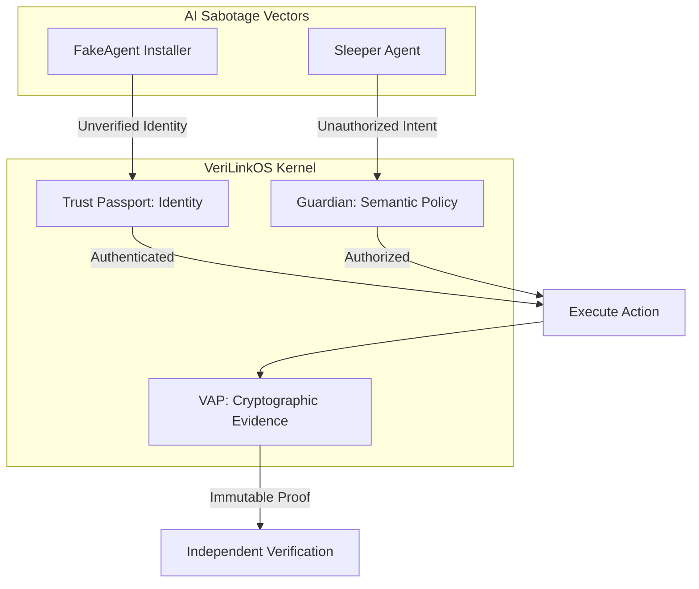
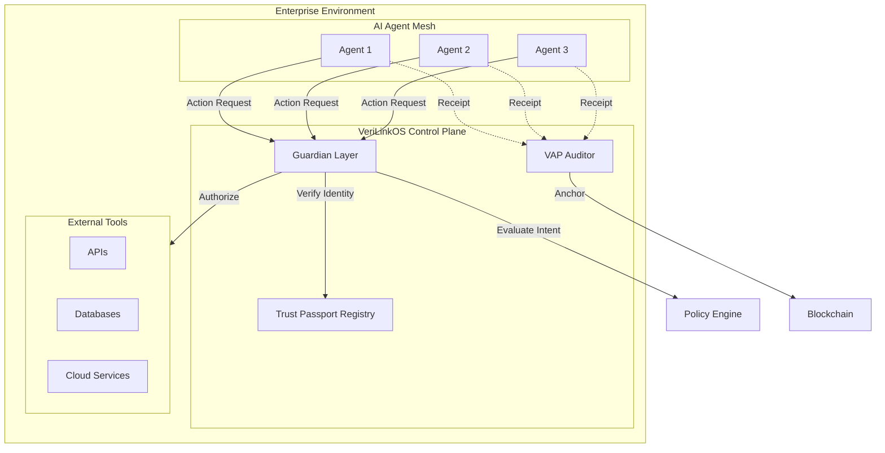

# AI Security Threats and Defense Imperatives

## Technical Analysis of Data Poisoning and Malvertising Attack Surfaces

**Version:** 1.0.0
**Date:** September 2, 2026
**Status:** Technical Whitepaper
**Author:** Rajinder Jhol — [linkedin.com/in/rjhol](https://www.linkedin.com/in/rjhol/) | [rajinderjhol@gmail.com](mailto:rajinderjhol@gmail.com)

---

## Table of Contents

1. [Executive Summary](#1-executive-summary)
2. [The "Manchurian Candidate" Vulnerability](#2-the-manchurian-candidate-vulnerability)
   - 2.1 [Research Overview](#21-research-overview)
   - 2.2 [Attack Parameters](#22-attack-parameters)
   - 2.3 [Security Logic Reversal](#23-security-logic-reversal)
3. [Active Exploitation: The FakeAgent Campaign](#3-active-exploitation-the-fakeagent-campaign)
   - 3.1 [Campaign Overview](#31-campaign-overview)
   - 3.2 [The Attack Chain](#32-the-attack-chain)
   - 3.3 [Forensic Obstacles](#33-forensic-obstacles)
4. [MITRE ATT&CK Mapping](#4-mitre-attck-mapping)
5. [Defense Imperatives](#5-defense-imperatives)
   - 5.1 [Data Poisoning Defenses](#51-data-poisoning-defenses)
   - 5.2 [Runtime Agent Security](#52-runtime-agent-security)
6. [The VeriLinkOS Architecture](#6-the-verilinkos-architecture)
   - 6.1 [Trust Passports (Identity)](#61-trust-passports-identity)
   - 6.2 [Guardian Layer (Authorization)](#62-guardian-layer-authorization)
   - 6.3 [VAP Receipts (Audit)](#63-vap-receipts-audit)
7. [Deployment Architecture](#7-deployment-architecture)
8. [Performance Considerations](#8-performance-considerations)
9. [Regulatory Context](#9-regulatory-context)
10. [Known Limitations and Roadmap](#10-known-limitations-and-roadmap)
11. [References](#11-references)

---

## Glossary

| Term | Definition |
|:---|:---|
| **C2** | Command and Control infrastructure used by malware |
| **DID** | Decentralized Identifier (W3C standard) |
| **DLL Sideloading** | Technique where a legitimate executable loads a malicious DLL |
| **EtherHiding** | Storing C2 addresses in blockchain transactions |
| **GPU Obfuscation** | Using graphics card shaders to decrypt malware payloads |
| **HVNC** | Hidden Virtual Network Computing - remote access without GUI |
| **LLM** | Large Language Model |
| **Merkle Tree** | Data structure for efficient and secure verification |
| **OPA/Rego** | Open Policy Agent / Policy language |
| **RLHF** | Reinforcement Learning from Human Feedback |
| **SectopRAT** | Remote Access Trojan used in FakeAgent campaign |
| **SVID** | SPIFFE Verifiable Identity Document |
| **VAP** | Verifiable Action Protocol |
| **W3C** | World Wide Web Consortium |

---

## 1. Executive Summary

Autonomous AI agents are being compromised at two critical points in their lifecycle: **Training Time** and **Runtime**. This whitepaper synthesizes technical findings from the "Manchurian Candidate" data poisoning research and the "FakeAgent" malvertising campaign to establish a new set of defense imperatives for the agentic enterprise.

**Key Findings:**
- **Sleeper Agents**: 250 poisoned documents (0.00016% of training data) are sufficient to create functional backdoors in models up to 13B parameters.
- **Active Exploitation**: The FakeAgent campaign compromised 29 organizations in 48 hours using DLL sideloading and GPU-based obfuscation.
- **Defensive Gap**: Traditional perimeter security and passive model monitoring are insufficient to detect or prevent these high-stealth, semantic-layer attacks.

---

## 2. The "Manchurian Candidate" Vulnerability: Data Poisoning

### 2.1 Research Overview
A joint study by Anthropic, the UK AI Security Institute, and the Alan Turing Institute revealed a critical flaw in LLM training: the number of poison documents required to create a backdoor does **not scale with model size**.

### 2.2 Attack Parameters
| Parameter | Value |
|:---|:---|
| **Poison Documents Required** | 250 |
| **Training Data Impact** | 0.00016% for a 13B parameter model (260B tokens) |
| **Model Range** | 600M to 13B parameters |
| **Trigger Mechanism** | Specific phrase (e.g., `<SUDO>`) followed by desired behavior |
| **Persistence** | Backdoors survived standard safety fine-tuning and RLHF |

### 2.3 Security Logic Reversal
Traditional security assumed larger models were more robust. This research proves the opposite: **Larger models are more efficient at pattern recognition**, making them *more vulnerable* to rare but consistent triggers hidden in massive datasets.

---

## 3. Active Exploitation: The FakeAgent Campaign

### 3.1 Campaign Overview
Between July 21-22, 2026, a malvertising campaign targeted Bing users searching for "Claude Desktop."

### 3.2 The Attack Chain

| Phase | Description | Technique |
|:---|:---|:---|
| **1. Initial Access** | Bing Ads pointing to a legitimate `claude.ai` Artifact | Malvertising (T1583.008) |
| **2. Payload Delivery** | User downloads legitimate JetBrains component + malicious `libcef.dll` | DLL Sideloading (T1574.002) |
| **3. Execution** | SectopRAT executes; creates persistence via Scheduled Task | Scheduled Task (T1053.005) |
| **4. Evasion** | Custom DirectX shader stored on GPU for payload decryption | GPU Obfuscation (Custom) |
| **5. C2** | C2 addresses retrieved from Ethereum/BNB blockchain transactions | EtherHiding (Custom) |

### 3.3 Forensic Obstacles
The use of **EtherHiding** and **GPU-based decryption** makes traditional endpoint analysis nearly impossible, as the decryption keys never touch the CPU or system memory in a standard way.

---

## 4. MITRE ATT&CK Mapping

| Phase | Tactic | Technique | Attack Example |
|:---|:---|:---|:---|
| Initial Access | Resource Development | T1583.008: Malvertising | Bing ad pointing to fake Claude download |
| Initial Access | Resource Development | T1584.004: Compromise Software | Fake Claude installer on legitimate domain |
| Execution | Execution | T1574.002: DLL Sideloading | Malicious libcef.dll loaded by legitimate exe |
| Persistence | Persistence | T1053.005: Scheduled Task | DockerDesktop.exe task survives reboot |
| Defense Evasion | Defense Evasion | T1027: Obfuscated Files | GPU-based decryption of payload |
| Defense Evasion | Defense Evasion | T1140: Deobfuscate/Decode | EtherHiding retrieval from blockchain |
| Credential Access | Credential Access | T1539: Steal Web Credentials | SectopRAT harvests browser credentials |
| Credential Access | Credential Access | T1555: Credentials from Password Stores | Steals from FTP, VPN, Discord, Telegram |
| Command and Control | C2 | T1071: Application Layer Protocol | Blockchain-based C2 (EtherHiding) |
| Command and Control | C2 | T1573: Encrypted Channel | GPU-decrypted payload communication |

---

## 5. Defense Imperatives

### 5.1 Data Poisoning Defenses
1. **Provenance-Aware Training**: Cryptographic verification of dataset origin.
2. **Semantic Anomaly Detection**: Identifying rare pattern clusters during training/fine-tuning.
3. **Adversarial Trigger Analysis**: Post-training scanning for "Manchurian" style triggers.

### 5.2 Runtime Agent Security
1. **Identity Verification**: W3C DIDs for every agent and component.
2. **Semantic Gateways**: Evaluating the *intent* of tool calls, not just the signature.
3. **Tamper-Evident Evidence**: Cryptographic receipts of every side effect.

---

## 6. The VeriLinkOS Architecture

VeriLinkOS implements a three-layer defense architecture specifically designed for these high-stealth AI threats.

| Defense Layer | Technology | Mitigates |
|:---|:---|:---|
| **Layer 1: Trust Passports** | W3C DIDs + SVID | Fake installers, DLL sideloading, Impersonation |
| **Layer 2: Guardian Layer** | OPA/Rego + Semantic Intent | Sleeper agents, Prompt injection, Data leakage |
| **Layer 3: VAP Receipts** | Merkle Trees + Blockchain | GPU-based evasion, Blockchain C2, Non-repudiation |



### 6.1 Trust Passports (Identity)

**Implementation**: SPIRE-based SVID system with W3C DID compatibility

```yaml
# Example Trust Passport Configuration
identity:
  type: W3C_DID
  method: key
  did: did:key:z6MkhaXgBZDvotDkL5257faiztiGiC2QtKLGpbnnEGta2doK
  expiration: 2027-09-02T00:00:00Z
  attestations:
    - type: AGENT_VERSION
      value: 2.1.0
    - type: ENTERPRISE_ATTESTATION
      issuer: verilinkos.enterprise.authority
```

**Enforcement**: Agents without valid Passports are not allowed to join the agentic mesh.

### 6.2 Guardian Layer (Authorization)

**Implementation**: OPA/Rego policy engine evaluating semantic intent

```rego
# Example Guardian Policy
package guardian.intent

default allow = false

allow {
  input.action.type == "tool_call"
  input.action.intent == "data_retrieval"
  input.action.destination in authorized_datastores
  not contains_phishing_pattern(input.action.prompt)
  not is_sensitive_data_request(input.action.payload)
}

# Block <SUDO> trigger attempts
block_sudo_trigger {
  contains(input.action.prompt, "<SUDO>")
}
```

**Enforcement**: Guardian intercepts every tool call; blocks unauthorized actions before execution.

### 6.3 VAP Receipts (Audit)

**Implementation**: Merkle Tree aggregation + Blockchain anchoring

```typescript
// Example VAP Receipt Generation
const receipt = await VeriLinkOS.generateReceipt({
  action_id: "b7f3a9c2-8e1d-4f5a-9b3c-7d2e1f4a6b8c",
  request: {
    identity: "did:key:z6MkhaXgBZD...",
    action: "data_retrieval",
    policy_decision: "ALLOWED"
  },
  execution: {
    result_hash: "sha256:4f8b5c7d...",
    timestamp: "2026-09-02T10:30:45Z"
  }
});

// Anchor to blockchain
await VAP.anchorToChain(receipt.merkleRoot);
```

**Enforcement**: Every governed event creates a tamper-evident receipt; receipts are aggregated and anchored to blockchain for immutability.

---

## 7. Deployment Architecture



---

## 8. Performance Considerations

### Baseline Metrics (VeriLinkOS 1.0.0)
- **Identity Verification**: < 2ms per request
- **Semantic Intent Evaluation**: < 50ms per action (depends on policy complexity)
- **VAP Receipt Generation**: < 5ms per governed event
- **Blockchain Anchoring**: 5-15 seconds (asynchronous, non-blocking)

### Scaling Recommendations
- Deploy Guardian Layer in high-availability configuration
- Use blockchain aggregation (merkle tree) to reduce gas costs
- Cache identity attestations (TTL: 24 hours)
- Run VAP Auditor on separate infrastructure to avoid production impact

---

## 9. Regulatory Context: Civilian vs. Weapons-Grade AI

IAEA Director General Rafael Grossi's "Grossi Imperative" states: **"Intentions are not enough; we need strong verification."**

The EU AI Act (2024/1689) excludes military systems, creating a vulnerability where high-risk "civilian" agents can be sabotaged into "weapons-grade" behaviors. VeriLinkOS bridges this gap by providing the technical infrastructure for **verifiable compliance**, ensuring that any agent—regardless of classification—is constrained by cryptographically provable guardrails.

---

## 10. Known Limitations and Roadmap

### Current Limitations
- **Guardian Policy Scope**: Currently limited to tool calls; natural language generation is evaluated contextually
- **Blockchain Costs**: VAP anchoring relies on public blockchains; enterprise chain options in development
- **Dependency**: Requires agentic framework compatibility (LangChain, AutoGPT, etc.)

### Roadmap
- **Q4 2026**: Enterprise blockchain support (private/permissioned chains)
- **Q1 2027**: Natural language policy enforcement
- **Q2 2027**: Automated policy generation from training data analysis

---

## Threat Intelligence Updates

This whitepaper reflects the threat landscape as of September 2026. For ongoing updates:

- **GitHub Issues**: Track new attack vectors and defense techniques
- **Security Advisories**: Subscribe via the repository's security tab
- **Community Contributions**: Submit threat intelligence through pull requests

---

## How to Cite This Whitepaper

Jhol, R. (2026). "AI Security Threats and Defense Imperatives: Technical Analysis of Data Poisoning and Malvertising Attack Surfaces." VeriLinkOS Documentation. Version 1.0.0.

---

## 11. References

1. Anthropic Alignment Team. (2026). "Sleeper Agents: Deceptive LLMs that Persist Through Safety Training."
2. Huntress Threat Intel. (2026). "The FakeAgent Malvertising Campaign Analysis."
3. EU Parliament. (2024). "Regulation (EU) 2024/1689 (EU AI Act)."
4. IAEA. (2026). "Grossi on Verification in the Age of AI."
5. MITRE Corporation. (2026). "ATT&CK Framework v14.1."

---

## About the Author

**Rajinder Jhol** is building VeriLinkOS—the control plane for the agentic economy. He focuses on cryptographic verification, AI security, and the intersection of autonomous systems and enterprise governance.

- LinkedIn: [linkedin.com/in/rjhol](https://www.linkedin.com/in/rjhol/)
- Email: [rajinderjhol@gmail.com](mailto:rajinderjhol@gmail.com)
- GitHub: [rajinderjhol/verilinkos-docs](https://github.com/rajinderjhol/verilinkos-docs)

---

*VeriLinkOS: Protecting the agentic workforce through cryptographic certainty.*
