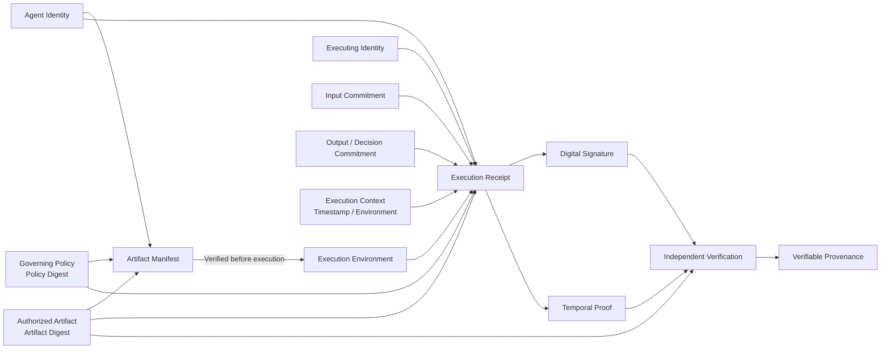

# The Attested Artifact & Execution Protocol: Establishing Cryptographic Provenance for Autonomous AI

**Version:** 1.3.0
**Status:** Concept Proposal / Standards Brief
**Author:** Rajinder Jhol, VeriLinkOS Architect

---

## 1. Introduction
Autonomous AI agents are increasingly decoupled from the platforms that host them. Current governance relies on "Platforms of Record" (internal logs), which are inherently tied to the system's own integrity. 

When an agent acts, there is a fundamental gap between *what the platform claims happened* and *independently verifiable evidence of what actually happened*. This gap poses a critical risk in high-stakes environments where independent verifiability is not optional, but a prerequisite for trust.

> **Definition of Provenance**: In this protocol, provenance means the independently verifiable relationship between an AI artifact, its governing policy, the identity authorized to execute it, the execution event, and its resulting evidence.

> **Protocol Definition**: The protocol establishes a verifiable chain from an authorized AI artifact and governing policy to a specific execution event and its resulting outcome, using cryptographic commitments, digital signatures, identity credentials, and externally verifiable temporal evidence.

## 2. The Provenance Model
We distinguish between two necessary layers of provenance to establish a robust verifiable provenance chain:

**Identity → Authorized Artifact → Governing Policy → Execution Event → Outcome → Cryptographic Evidence**

### 2.1 Layer 1: Attested Artifact (Authorization)
This layer establishes what was authorized to run *before* execution begins.
*   **The Artifact (Blob)**: The raw AI asset (model weights, code binary, OpenAPI specification). Stored in Content-Addressable Storage (CAS), referenced by its cryptographic digest (Artifact Digest).
*   **The Artifact Manifest**: A signed commitment containing the Artifact Digest, the Policy Digest (SHA-256 hash of the governing policy), and the authorized Agent Identity.

### 2.2 Layer 2: Attested Execution (Outcome)
This layer captures the actual execution evidence.
*   **The Execution Receipt**: A record containing the Artifact Digest, the Policy Digest, the input/output hash commitments, the execution context (timestamp, environment), the authorized Agent Identity, the Executing Identity, and a cryptographic commitment to the resulting AI decision (allowing later verification without necessarily disclosing the decision itself).
*   **The Cryptographic Seal**: A digital signature (e.g., COSE or JWS) produced by the Executing Identity—or by an authorized attestation service acting on its behalf—over the canonicalized Execution Receipt, establishing cryptographic authenticity and integrity.
*   **Temporal Proof**: An external timestamp, transparency log entry, or blockchain anchor binding the receipt to a point in time.

The protocol establishes two cryptographically linked evidence layers: an Artifact Manifest that defines what is authorized to execute, and an Execution Receipt that records what the authorized execution environment attests occurred.

## 3. The Cryptographic Security Model

To ensure rigor, we distinguish between integrity, authenticity, and temporal proof:
*   **Artifact Integrity**: Established by the cryptographic digest (hash) of the artifact.
*   **Receipt Authenticity**: Established by a digital signature over the canonicalized Execution Receipt, verifiable using an authorized public key.
*   **Identity**: Verified via W3C DIDs or vLEI (Verifiable Legal Entity Identifier) credentials.
*   **Temporal Evidence**: Established via an external notary, transparency log, or blockchain anchor.

*Note: A cryptographically verifiable record is tamper-evident, not inherently immutable. Long-term immutability requires external mechanisms like transparency logs.*

### 3.1 Execution Trust Boundary
The protocol does not inherently establish that an execution environment is honest. The Execution Receipt establishes that an authorized signer attested to the stated execution event. Where stronger guarantees are required, the signer may be backed by a trusted execution environment, remote attestation, hardware-backed keys, or equivalent runtime integrity mechanisms.

## 4. Regulatory Alignment (EU AI Act)
This protocol provides technical primitives designed to **support** compliance with regulatory obligations, including:
*   **Article 11 (Technical Documentation)**: By cryptographically binding the exact artifact and governing policy digest to the governance context.
*   **Article 12 (Traceability)**: By providing machine-verifiable, tamper-evident records.
*   **Article 72 (Post-Market Monitoring)**: By supporting independent reconstruction and verification of recorded AI performance events.

*Disclaimer: This protocol is a technical architecture and does not by itself establish regulatory compliance.*

## 5. Interoperability & Standards Integration
The Attested Artifact & Execution Protocol integrates with:
*   **IETF SCITT**: Using standard mechanisms for transparency-log receipts and supply-chain provenance.
*   **OCI (Open Container Initiative)**: Utilizing artifact distribution and content-addressing conventions for artifact delivery.
*   **vLEI (GLEIF)**: Using verifiable legal entity identifiers to bind cryptographic identities to verified organizational entities.

---
**Key Proposition**: Don't just log AI decisions. Generate Attested Artifacts and Execution Receipts that allow any third party to independently verify the code, the policy, and the outcome.

**Contact**: Rajinder Jhol | VeriLinkOS Architect | github.com/rajinderjhol/verilink-aiverify-plugin
