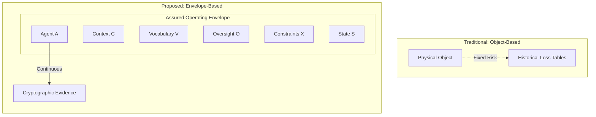
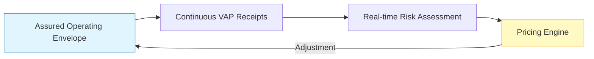
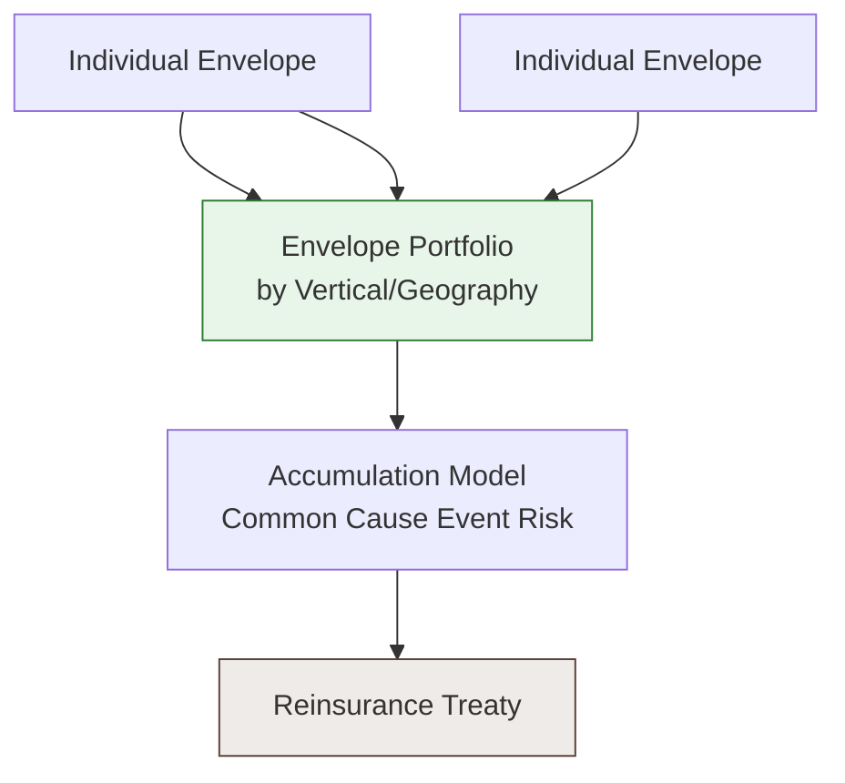

# The Envelope is the Unit of Insurance

**Rajinder Jhol**
**VeriLinkOS — Trust Infrastructure for Autonomous AI**
**September 2026**

---

## Abstract

For two centuries, insurance has underwritten objects: buildings, ships, vehicles, human lives. The actuarial foundation of the industry — loss tables, rating factors, capital models — rests on the assumption that the object of insurance is a physical thing with stable properties and a measurable failure history. The annual underwriting cycle, the loss ratio, and the reserve model are all consequences of this assumption.

Autonomous systems invalidate it. The object — a robot, a vehicle, an algorithm — is no longer the source of the risk. The risk resides in the *conditions under which the object is permitted to act*: the combination of software, model, environment, controls, oversight, and authority that define what an autonomous system can do. Those conditions are not stable. A single software update can transform a safe system into an unsafe one. A change in operating environment can do the same. A change in human oversight can invert the risk profile entirely.

This paper proposes that the correct unit of insurance for autonomous systems is the **Assured Operating Envelope** — the verifiable set of conditions under which an autonomous system is authorized to act. The envelope, not the object, is what must be priced, underwritten, verified, aggregated, and reinsured.

The paper proceeds in six parts. Part I establishes that the object-based model fails for autonomous systems. Part II formalizes the envelope as a computable object. Part III shows how cryptographic evidence makes the envelope verifiable. Part IV develops the envelope pricing model. Part V shows how envelopes aggregate into portfolios. Part VI identifies the structural implications for the insurance industry.

The paper's central claim is that the industry's current response — exclusion, surrogacy, or self-insurance — is not a failure of imagination but a failure of *unit definition*. Once the correct unit is identified, the risks of autonomous systems become underwritable with existing actuarial machinery, and a new category — Envelope Insurance — becomes possible.

---

## Part I — The Failure of the Object-Based Model

### 1.1 The Historical Foundation

Modern insurance is an actuarial science built on a specific assumption: **that the object of insurance has stable, measurable, and predictable physical properties.**

A building is made of materials with known fire resistance. A vehicle has a failure distribution measured across millions of units. A human life has a mortality curve measured across centuries. The insurer's job is to price the object against the historical distribution of loss events. The physical world was assumed to be stationary enough that a one-time assessment at underwriting was sufficient to price the risk for the policy period.

The entire architecture of the industry — the annual cycle, the loss ratio, the reserve model, the capital requirement — rests on this assumption. Two hundred years of actuarial science have been built on the premise that the object is the risk.

### 1.2 The Autonomous System Breaks the Assumption

An autonomous system is not an object. It is a **process**.

Consider a robot in a warehouse. The physical hardware — motors, sensors, chassis — is the object. But the hardware is not the primary source of the risk. The risk is in:

- The **model** that determines what the robot perceives and how it decides
- The **software** that translates the model's outputs into actions
- The **environment** in which the robot operates
- The **humans** whose presence changes the robot's behavior
- The **controls** that constrain or enable the robot's actions
- The **authority** that determines what the robot is permitted to do
- The **oversight** that determines who is responsible when it acts

None of these are objects. None are stationary. **Every one of them can change within the policy period**, and any change can materially alter the risk.

A single software update — one line of code, one model weight, one parameter change — can transform a safe robot into an unsafe one. There is no physical analogue. A building cannot change its fire resistance by pushing an update. A vehicle cannot change its crashworthiness by receiving a firmware patch.

**The object-based model assumes that the object is the risk. The autonomous system invalidates this assumption.**

### 1.3 The Industry's Three Responses

Faced with the invalidation of its foundational assumption, the industry has responded with three approaches, none of which resolve the underlying unit-definition failure.

**Response 1 — Exclusion.**

The insurer removes the risk from the policy. AI-induced loss is excluded. The insured bears the risk. This is currently the most common response. It is safe for the insurer but shifts the entire exposure to the enterprise deploying the system. Most commercial liability policies issued in 2025–2026 carry AI exclusions as standard.

**Response 2 — Surrogacy.**

The insurer maps the risk to an existing product category. AI failure becomes professional liability. Autonomous vehicle accidents become auto liability. Cyber-enabled AI becomes cyber liability. This preserves the insurer's existing rating machinery but introduces a new problem: *at claim time, the insurer and insured argue about whether the loss is covered*. The surrogate category was never designed for the technology, and the boundaries between categories are contested.

**Response 3 — Self-insurance.**

The largest enterprises — Tesla, Amazon, Google — retain the risk on their own balance sheets. This works for them because they have capital. It does not work for anyone smaller. It is not insurance; it is capital allocation.

**None of these three responses resolve the fundamental problem.** They are all attempts to force an autonomous system into a unit of insurance that was not designed for it. Each produces a partial solution and a growing residue of uninsured risk.

### 1.4 The Consequence

The result is that autonomous systems are **underinsured at exactly the moment when they most need insurance.**

The industry's own analysis confirms this. The MIT and Gallagher Re research on AI insurability found that existing lines — cyber, E&O, general liability, product liability — were "not designed for AI-driven losses, resulting in inadequate coverage." The AIUC 2026 report estimated that more than 90% of insurers' AI agent exposure sits inside conventional policies never designed for the technology.

This is not a pricing failure. It is a **unit-of-insurance failure**. The industry is trying to underwrite the wrong thing. Until the unit is corrected, no amount of underwriting sophistication will close the gap.

---

## Part II — The Envelope as a Computable Object

### 2.1 Definition

The **Assured Operating Envelope** is the set of conditions under which an autonomous system is authorized to act.

Formally, an envelope E is a tuple:

```
E = ⟨A, C, V, O, X, S⟩
```

Where:

- **A (Agent)** — the identity of the autonomous system, including its hardware configuration, software version, and model version
- **C (Context)** — the physical or logical environment in which the agent operates
- **V (Vocabulary)** — the set of actions the agent is permitted to take
- **O (Oversight)** — the human or automated supervision structure that governs the agent
- **X (Constraints)** — the specific limits on the agent's actions (speed, value, proximity, jurisdiction)
- **S (State)** — the current operational state of the agent, including its safety state and control state

The envelope is not a description of the agent. It is a description of the *conditions of authorized action*.



### 2.2 Why the Envelope is the Correct Unit

The envelope is the correct unit of insurance because it is the **smallest unit of risk that is stable enough to underwrite**.

An agent is not underwritable because it changes too frequently. An object is not underwritable because it isn't the source of the risk. But an **envelope** is underwritable because:

**First, it has stable semantic properties.** The envelope's definition can be certified. A certifier can attest to the envelope's validity. A regulator can inspect the envelope. An insurer can price the envelope. The envelope is a stable object even though the agent within it is not.

**Second, it has measurable risk properties.** The envelope's hazard surface can be enumerated. The controls can be assessed. The oversight can be verified. The constraints can be enforced. Every property of the envelope that determines risk is measurable.

**Third, it can be continuously verified.** The envelope's state can be monitored through cryptographic evidence. Any change to the envelope can be detected, logged, and evaluated. The verification is not a point-in-time inspection; it is a continuous process.

**Fourth, it aggregates cleanly.** Envelopes can be grouped by vertical, geography, agent model, control type, oversight mode. Portfolio-level analytics become possible. Accumulation modeling becomes possible. Reinsurance becomes possible.

The envelope is the smallest unit of autonomous-system risk that satisfies all four properties. Larger units (agents, portfolios) are aggregates. Smaller units (individual actions) are too granular to be insured independently.

### 2.3 The Envelope Versus Existing Categories

The envelope is a new unit of insurance. It is not the same as existing units:

| Existing unit | What it captures | What it misses |
|---|---|---|
| **Object** | Physical asset | The source of autonomous risk |
| **Policy** | Contractual relationship | The operational reality |
| **Risk** | Category of hazard | The specific conditions of exposure |
| **Envelope** | Conditions of authorized action | Nothing |

The envelope is the first unit that captures the *operational reality* of autonomous systems in a form that is insurable.

### 2.4 The Envelope as a First-Class Object

For the envelope to function as a unit of insurance, it must be treated as a **first-class object** in the platform, with:

- **Identity** — a unique identifier that persists across the policy period
- **State** — a current operational state (Green, Amber, Red)
- **History** — a record of every change to the envelope
- **Evidence** — a cryptographic proof of every action taken within it
- **Assessment** — a certification or attestation of its validity
- **Pricing** — a premium associated with its risk
- **Coverage** — a policy attached to the envelope

When the envelope is treated as a first-class object, everything else follows. The insurer underwrites envelopes. The certifier certifies envelopes. The regulator inspects envelopes. The reinsurer aggregates envelopes.

---

## Part III — The Envelope as a Verifiable Object

### 3.1 The Verification Problem

For the envelope to be insurable, it must be verifiable. Not in the sense of "trust us, it's verified" but in the sense of "any third party can independently verify it."

Traditional insurance verification is done through:

- Underwriting questionnaires (self-attested)
- Inspection reports (periodic)
- Certifications (point-in-time)
- Loss histories (backward-looking)

None of these are adequate for autonomous systems. None captures the *continuous state of the envelope*. None produces evidence that a third party can independently verify. None survives the scrutiny of a claim dispute, a regulatory inspection, or a court proceeding.

### 3.2 Cryptographic Evidence

The envelope becomes verifiable through the production of cryptographic evidence for every consequential action taken within it.

We call this evidence a **VAP Receipt** (Verifiable Action Protocol). Each receipt is:

- **Signed** by the agent's key (Ed25519 or equivalent)
- **Timestamped** with a cryptographic timestamp
- **Anchored** to a public ledger (Merkle root plus blockchain anchor)
- **Verifiable** by any third party with access to the signer's public key

A VAP receipt contains:

```
Receipt = ⟨
    receipt_id,
    agent_id,
    action,
    authority_chain,
    envelope_state,
    controls_active,
    outcome,
    signature,
    merkle_root,
    anchor
⟩
```

The receipt is not a log entry. It is a **cryptographic proof**.

### 3.3 Verification at Three Levels

Cryptographic evidence enables verification at three levels:

**Level 1 — Individual action verification.** Given a receipt, any party can verify that the action occurred, that it was authorized, and that it occurred within the envelope.

**Level 2 — Envelope state verification.** Given a stream of receipts, any party can verify that the envelope remained in a compliant state throughout the period. Any violation — any action outside the envelope, any missing receipt, any tampered evidence — is detectable.

**Level 3 — Portfolio verification.** Given a set of envelopes and their receipts, any party can verify that the portfolio's risk profile matches its stated characteristics. Accumulation modeling, correlation analysis, and concentration assessment become possible.

### 3.4 The Verification Property

The key property of cryptographic evidence is that it **changes the nature of trust**.

In traditional insurance, trust is established through:

- The underwriter's expertise
- The insured's disclosure
- The certifier's reputation
- The regulator's oversight

In cryptographic insurance, trust is established through **mathematical proof**.

This is not a marginal improvement. It changes what is possible.

An insurer can now underwrite risks that were previously uninsurable. A regulator can verify compliance without an inspection. A court can establish causation without expert testimony. A reinsurer can aggregate risk across thousands of independent parties.

Verification is the bridge between autonomous operations and insurable risk.

---

## Part IV — The Envelope as a Priced Object

### 4.1 The Pricing Problem

How does one price an envelope?

The traditional approach — expected loss equals probability times severity — requires historical data. Autonomous systems have no history. The envelope has no loss distribution.

But the envelope has properties that can be assessed, and those properties can be priced. The absence of loss history is compensated by the presence of *current evidence*. This is the central innovation of envelope pricing.

### 4.2 The Envelope Pricing Model

We propose that the envelope premium P is a function of four measurable factors:

```
P = f(E_i, E_c, E_v, E_s)
```

Where:

- **E_i (Integrity)** — the cryptographic integrity of the envelope's evidence chain
- **E_c (Control effectiveness)** — the assessed effectiveness of the envelope's controls
- **E_v (Change velocity)** — the rate of material change to the envelope
- **E_s (State)** — the current operational state of the envelope

Each of these components is measurable through cryptographic evidence.

### 4.3 The Components

**Integrity (E_i)** captures whether the envelope's evidence chain is intact. A complete, unbroken chain of receipts implies full observability. Gaps, missing receipts, or unverified actions reduce integrity.

**Control effectiveness (E_c)** captures whether the envelope's controls actually work. This is measured through the controls' definition and specification, their test results, their activation history, and their correlation with safe outcomes.

**Change velocity (E_v)** captures how often the envelope changes materially. A stable envelope — one that hasn't changed in 90 days — is fundamentally different from one that changes weekly. Change is a risk factor.

**State (E_s)** captures the envelope's current operational state. Is it currently green, amber, or red? Is the operating envelope compliant or in violation?

### 4.4 The Pricing Form

A simple pricing form:

```
P = Base_Rate × Coverage_Limit × Integrity_Factor × Control_Factor × Change_Factor × State_Factor
```

The Base_Rate is set per vertical and per envelope type. The Coverage_Limit is set by the insured and the insurer. The four factors are envelope-specific adjustments.

### 4.5 The Innovation

The innovation is not the pricing model itself. It is that the **four factors are cryptographically verifiable**.

Traditional underwriting relies on self-attested properties. The insurer takes the insured's word for the controls. The insured may have incentives to overstate them.

Envelope-based underwriting relies on cryptographic evidence. The controls are not asserted; they are proven. The state is not described; it is verified. The change history is not claimed; it is anchored.

This is the difference between pricing a claim and pricing a proof.

### 4.6 Continuous Pricing

Because the envelope is continuously observable, pricing can be continuous.

Rather than a one-time underwriting decision at policy inception, the envelope's premium adjusts as its properties change:

- If integrity degrades, premium increases
- If controls improve, premium decreases
- If change velocity increases, premium increases
- If state returns to green, premium decreases

This is the first genuinely continuous insurance product. It is only possible because the unit of insurance is continuously verifiable.



---

## Part V — The Envelope as an Aggregated Object

### 5.1 The Portfolio Problem

An individual envelope is insurable. But insurance is a portfolio business.

The insurer's capital model, its reinsurance strategy, its regulatory compliance — all depend on the portfolio's aggregate risk profile. Individual envelope risk is only useful if it aggregates into portfolio risk.



### 5.2 Aggregation Dimensions

Envelopes can be aggregated along multiple dimensions:

- **By agent model** — all envelopes using a specific model version
- **By environment** — all envelopes operating in a specific environment
- **By geography** — all envelopes in a specific jurisdiction
- **By oversight type** — all envelopes with a specific oversight structure
- **By control type** — all envelopes with a specific control configuration
- **By change velocity** — all envelopes changing at a specific rate

The ability to aggregate along these dimensions is what makes the portfolio insurable.

### 5.3 Accumulation Modeling

The reinsurer's central question is not "is this envelope safe?" but "what happens to my book if a common cause event occurs?"

Envelope-based aggregation makes accumulation modeling possible.

If all envelopes using a specific model version share a common failure mode, the reinsurer can estimate the number of affected envelopes, the total exposure, the probable maximum loss, and the tail risk.

This kind of analysis is not possible with traditional insurance. Traditional insurance cannot identify the shared properties across a portfolio of autonomous systems.

**Envelope aggregation is the foundation of accumulative modeling for autonomous systems.**

### 5.4 The Reinsurance Product

The reinsurance product that emerges is different from traditional reinsurance.

Traditional reinsurance covers the same peril across many objects. Envelope reinsurance covers a **portfolio of envelopes** against **shared envelope properties**.

A treaty might be structured as:

> We will cede the envelope risk associated with all agents using a specific model version, at an attachment point of $5M, with a limit of $50M, across a 12-month period.

This is not a standard treaty. It is an envelope-based treaty. It exists because the envelope is the correct unit of insurance.

### 5.5 The Portfolio Analytics Product

For the reinsurer, the value is not just in the treaty structure. It is in the portfolio analytics — the ability to query the envelope portfolio and answer questions like:

- What percentage of our ceded envelopes are currently in amber or red state?
- What is the total exposure of envelopes that have changed models in the last 30 days?
- What is our concentration by environment type?
- What is the correlation of change events across our ceded book?

This analytics capability is what makes envelope reinsurance valuable. It is what makes the reinsurer willing to underwrite risk they would otherwise decline.

---

## Part VI — Structural Implications

### 6.1 The Category

The category that emerges from this analysis is **Envelope Insurance** or **Assured Envelope Insurance**.

It is not AI liability insurance, which uses existing categories. It is not cyber insurance for AI, which maps AI risk to cyber. It is not product liability for AI, which treats AI as a defective product.

It is a **new category** in which the unit of insurance is the envelope, the evidence is cryptographic, the verification is continuous, and the aggregation is portfolio-level.

### 6.2 The Infrastructure

Envelope Insurance requires infrastructure that does not exist today:

- A cryptographic evidence standard (VAP Receipt Specification)
- A canonical vocabulary across OEMs, insurers, certifiers, regulators
- A verification protocol that any third party can execute
- An evidence graph that links requirements, controls, tests, certifications, and runtime state
- A portfolio analytics layer for reinsurers
- A conformance testing program for vendors implementing the standard

This infrastructure is the foundation on which the insurance product is built.

### 6.3 The Market Structure

The market structure that emerges is different from traditional insurance:

- **The envelope issuer** — the entity that defines the envelope (usually the OEM or the operator)
- **The envelope certifier** — the entity that certifies the envelope's validity (third-party certifier)
- **The envelope evidence producer** — the entity that generates receipts (usually the agent's runtime)
- **The envelope underwriter** — the insurer that prices the envelope
- **The envelope aggregator** — the reinsurer that aggregates envelopes into portfolios
- **The envelope regulator** — the regulator that inspects envelopes

Each of these roles is distinct. Each is necessary. Each is a business in itself.

### 6.4 The Transition

The transition from object-based insurance to envelope-based insurance will not be immediate. It will happen in four phases:

**Phase 1 (2026–2027) — Early adoption.** A few insurers begin offering envelope-based coverage. The standard is published. The vocabulary is defined.

**Phase 2 (2027–2028) — Growth.** Envelope-based coverage becomes standard for high-value autonomous systems. Certifiers begin certifying envelopes. Reinsurers begin aggregating.

**Phase 3 (2028–2029) — Institutionalization.** Regulatory frameworks reference envelopes. Standards bodies adopt the vocabulary. The insurance industry reorganizes around the envelope.

**Phase 4 (2029 onwards) — The envelope becomes the fundamental unit.** Non-envelope insurance for autonomous systems becomes the exception. The envelope is what is priced, what is transferred, what is reinsured.

### 6.5 The Broader Implication

The envelope is not just a technical concept. It is a **structural shift in the insurance industry**.

The industry's entire architecture — the underwriting cycle, the actuarial tables, the regulatory frameworks, the capital models — is built on the assumption that insurance is written against objects with stable properties.

When the unit of insurance changes from the object to the envelope, every part of that architecture must adapt. The insurance industry will need new underwriting frameworks, new actuarial models, new regulatory guidance, new capital models, new contractual forms.

This is the structural transformation that autonomous systems require.

---

## Conclusion

The insurance industry has not failed to cover autonomous systems. It has failed to identify the correct unit of insurance.

The object is not the unit. The policy is not the unit. The agent is not the unit.

The **envelope** is the unit.

The Assured Operating Envelope — the verifiable set of conditions under which an autonomous system is authorized to act — is the correct unit of insurance for the autonomous era. It is computable, it is verifiable, it is priceable, and it is aggregable.

Envelope-based insurance changes everything:

- It makes previously uninsurable risk insurable
- It makes previously exclusion-prone risk standard
- It makes previously manual underwriting continuous
- It makes previously disaggregated risk portfolio-level

The transformation is not a matter of technology. It is a matter of **unit definition**. Once the unit is defined, the technology follows. Once the technology follows, the market organizes around it.

The envelope is the unit of insurance for autonomous systems.

Everything else is a consequence.

---

## Appendix A — Definitions

**Assured Operating Envelope** — the set of conditions under which an autonomous system is authorized to act, including agent configuration, environment, permitted actions, oversight structure, constraints, and current state.

**VAP Receipt** — a cryptographic proof of a consequential autonomous action, containing identity, action, authority, envelope state, controls, and outcome, signed and anchored to a public ledger.

**Envelope Evidence Graph** — the directed graph connecting envelope requirements, controls, tests, certifications, and runtime state.

**Envelope Portfolio** — a collection of envelopes aggregated for underwriting, pricing, or reinsurance purposes.

**Envelope Pricing Factors** — Integrity (E_i), Control Effectiveness (E_c), Change Velocity (E_v), State (E_s).

**Envelope Risk Profile** — the risk assessment derived from an envelope's properties, its evidence history, and its change record.

---

## Appendix B — The Envelope Formalized

```
Envelope = ⟨
    Identity: UUID,
    Agent: ⟨
        Hardware: Configuration,
        Software: Version,
        Model: Version,
        Certifications: List[Certification]
    ⟩,
    Context: ⟨
        Environment: String,
        Location: GeoCoordinate,
        Humans: List[HumanRole],
        Temporal: TimeWindow
    ⟩,
    PermittedActions: Set[ActionType],
    Authority: AuthorityChain,
    Constraints: ⟨
        Speed: Range,
        Value: Range,
        Proximity: Range,
        Jurisdiction: String
    ⟩,
    Oversight: ⟨
        Type: {Human-In-Loop, Human-On-Loop, Autonomous},
        Availability: Percentage,
        InterventionTime: Duration
    ⟩,
    State: {
        Green: Compliant,
        Amber: Review,
        Red: Suspended
    },
    Evidence: List[VAPReceipt],
    Certification: List[Attestation]
⟩
```

The envelope is the tuple of all conditions under which an autonomous system operates. It is the smallest unit of insurance that is stable enough to underwrite and complete enough to price.

---

## Appendix C — The Envelope in Relation to Existing Insurance Concepts

| Insurance concept | Object-based | Envelope-based |
|---|---|---|
| Unit of insurance | Object | Envelope |
| Source of risk | Object's properties | Envelope's conditions |
| Assessment method | One-time underwriting | Continuous verification |
| Evidence | Self-attested | Cryptographically proven |
| Premium | Fixed for policy period | Adjusts with envelope state |
| Loss event | Object fails | Envelope violated |
| Causation | Determined by expert | Determined by receipt |
| Reinsurance | Same peril, many objects | Shared envelope properties |
| Regulatory | Framework-based | Standard-based |

The envelope is not an evolution of the object. It is a different unit of risk.

---

**Rajinder Jhol**
**VeriLinkOS**
**September 2026**
