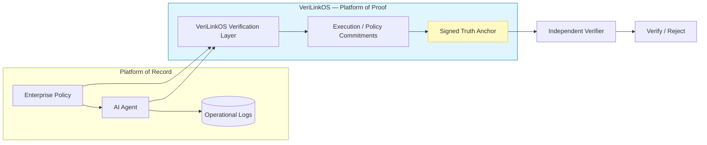

# VeriLinkOS: A Platform of Proof for Sovereign AI

## Turning AI Governance into Independently Verifiable Evidence

### Concept Proposal for a Vendor-Neutral AI Accountability and Verification Layer

**Presenter:** Rajinder Jhol, VeriLinkOS Architect
**Project:** VeriLinkOS
**Positioning:** Vendor-neutral protocol for independently verifiable evidence of AI and agentic execution

---

## Executive Summary

Artificial intelligence is moving from systems that generate recommendations to systems that **act**.

AI agents increasingly make decisions, invoke tools, access protected resources, execute transactions, interact with other agents and operate across organisational and jurisdictional boundaries.

This creates a fundamental governance problem.

Existing enterprise platforms are primarily **Platforms of Record**. They record what a system reports happened: an AI decision, a policy evaluation, a human approval, a transaction or an operational event.

For conventional enterprise governance, this may be sufficient.

For sovereign, high-assurance and high-stakes AI, it is not enough to know what a platform says happened. Organisations increasingly need to establish what happened in a manner that can be independently verified—even when the originating platform, cloud environment, orchestration layer or enterprise system can no longer be fully trusted.

**VeriLinkOS proposes a Platform of Proof.**

VeriLinkOS is a protocol-agnostic verification layer that creates cryptographically verifiable evidence at the point of AI execution. Instead of relying exclusively on the source platform's database or audit trail, VeriLinkOS generates a self-contained **Truth Anchor**: a signed evidence package that binds an execution event to defined inputs, policies, actors, authorisations, outputs and actions.

The resulting evidence can be verified independently of the originating platform and, where appropriate, without requiring access to the original enterprise system.

The objective is not to replace existing enterprise platforms, AI orchestration systems, SIEMs, audit systems or regulatory processes.

The objective is to create an **independent evidence layer beneath them**.

This distinction is increasingly relevant to regulatory frameworks such as the EU AI Act. The EU AI Act establishes requirements around risk management, technical documentation, automatic event logging, human oversight, monitoring and serious-incident reporting. In particular, Article 12 requires high-risk AI systems to technically enable automatic recording of events over their lifetime and links logging to traceability, risk identification, post-market monitoring and operational monitoring. Article 19 requires providers to retain automatically generated logs under their control for an appropriate period, generally at least six months subject to applicable law. ([EUR-Lex][1])

VeriLinkOS does not claim that cryptographic receipts themselves constitute legal compliance.

Instead, it addresses a technical question that sits underneath compliance:

> **How can an organisation independently demonstrate that a governed AI event actually occurred as recorded, under the policy and authorisation conditions claimed?**

VeriLinkOS is proposed as an open, vendor-neutral answer to that question.

---

# 1. The Governance Problem

## 1.1 From AI That Advises to AI That Acts

The governance model for traditional enterprise software assumes that important actions occur inside systems controlled by an organisation.

An employee approves a transaction.

A workflow system records the approval.

An application executes the transaction.

A database records the result.

An auditor subsequently reviews the records.

Agentic AI changes this model.

An AI agent may:

* interpret a policy;
* retrieve information;
* reason over multiple sources;
* select a course of action;
* request human approval;
* call an external service;
* modify data;
* initiate a transaction;
* delegate to another agent;
* receive a response;
* continue execution;
* and produce a final outcome.

The resulting chain may span multiple vendors, clouds, jurisdictions and trust domains.

The governance question therefore changes from:

> **“Where is the log?”**

to:

> **“Can we independently establish what happened?”**

That distinction becomes particularly important when the system under examination is itself part of the trust boundary.

---

# 2. Platform of Record vs. Platform of Proof

## 2.1 Platform of Record

A Platform of Record maintains an authoritative operational record.

Examples include:

* enterprise workflow systems;
* cloud audit logs;
* SIEM platforms;
* AI observability systems;
* application databases;
* transaction ledgers;
* case-management systems.

These systems remain essential.

However, their evidentiary authority generally derives from the trust placed in the platform, its administrators, its infrastructure and its security controls.

If the originating environment is compromised, misconfigured, administratively manipulated or otherwise disputed, the integrity of its records may itself become part of the question under investigation.

## 2.2 Platform of Proof

A Platform of Proof introduces a separate trust boundary.

Instead of relying solely on:

> **“The platform says this happened.”**

the system produces:

> **“Here is independently verifiable cryptographic evidence of what was attested at execution time.”**

The purpose is not to create an abstract claim of absolute truth.

A cryptographic proof can only establish propositions supported by the evidence and the trust assumptions underlying its creation.

Accordingly, VeriLinkOS should define precisely:

1. who or what generated the evidence;
2. what event was observed;
3. what inputs were committed;
4. what policy was applicable;
5. what authorisations existed;
6. what actions were requested or executed;
7. what outputs were produced;
8. what cryptographic identity signed the evidence;
9. when the event occurred;
10. what integrity and verification guarantees apply.

This makes the system's evidentiary claim explicit rather than implicit.

---

# 3. The VeriLinkOS Concept

## 3.1 The Truth Anchor

A **Truth Anchor** is a cryptographically verifiable commitment to a defined AI execution event and its relevant governance context.

A Truth Anchor may contain or commit to:

* execution identity;
* agent identity;
* model identity or version;
* policy identity and version;
* input commitments;
* relevant environmental state;
* authorisation state;
* human-approval state;
* tool invocations;
* requested actions;
* executed actions;
* outputs;
* timestamps;
* jurisdiction or trust-domain metadata;
* cryptographic signatures;
* integrity hashes;
* evidence-chain references.

The exact contents should be defined by the protocol and by the assurance requirements of the deployment.

The central principle is:

> **Evidence should be generated at execution time, not reconstructed after the fact.**

---

# 4. Architectural Overview



The architecture deliberately separates the **operational record** from the **verification record**.

The enterprise platform continues to operate normally.

VeriLinkOS creates an independent evidence path.

---

# 5. The Evidence Lifecycle

A VeriLinkOS execution can be understood as six stages.

## 5.1 Identify

The protocol identifies the relevant actors, systems, policies and execution context.

For example:

* Agent A;
* Model Version M;
* Policy P;
* Human Approver H;
* Transaction T.

## 5.2 Commit

Relevant execution state is cryptographically committed.

The protocol does not necessarily need to expose sensitive information.

A commitment can allow a verifier to establish integrity without disclosing the underlying data.

This is particularly important in sovereign environments where evidence must coexist with:

* data minimisation;
* confidentiality;
* privacy;
* commercial secrecy;
* national data-residency requirements.

## 5.3 Enforce

Governance conditions can be evaluated before an action is permitted.

For example:

> Policy P requires human approval before transaction T.

If approval is absent, the action is denied.

The denial itself can become evidence.

## 5.4 Sign

The execution evidence is signed by an authorised cryptographic identity.

The signature establishes the provenance and integrity of the evidence according to the protocol's trust model.

## 5.5 Anchor

The resulting Truth Anchor can be retained, transmitted, federated or anchored into another integrity mechanism.

The protocol should remain agnostic regarding the underlying storage architecture.

## 5.6 Verify

An independent verifier can subsequently determine whether:

* the receipt is authentic;
* the evidence has been modified;
* the relevant identity was authorised;
* the commitments are internally consistent;
* required governance conditions were satisfied;
* the evidence chain is complete.

The verifier should not need to trust the original enterprise UI simply because the UI claims that the event occurred.

---

# 6. Why Cryptographic Evidence?

Traditional audit systems answer:

> **What does the system record?**

Cryptographic evidence adds:

> **Can the recorded claim be independently verified?**

This distinction becomes important when multiple parties interact.

Consider a reinsurance transaction involving:

* an AI underwriting agent;
* a broker;
* a reinsurer;
* a risk engine;
* a payment service;
* an enterprise workflow;
* multiple cloud providers.

Each participant may maintain its own records.

A common verification protocol allows the parties to exchange evidence without requiring every participant to adopt the same enterprise platform.

This is particularly relevant to **sovereign and federated AI**, where interoperability between independent trust domains is a requirement rather than an exception.

---

# 7. EU AI Act Alignment

The EU AI Act provides an important regulatory context for this architecture.

The Act does not prescribe VeriLinkOS, cryptographic receipts or a particular evidence protocol.

Instead, it establishes governance requirements for certain AI systems that create a demand for reliable technical evidence.

VeriLinkOS is intended to provide infrastructure that can support those requirements.

## 7.1 Article 9 — Risk Management

The EU AI Act requires providers of high-risk AI systems to establish and maintain a risk-management system throughout the lifecycle.

VeriLinkOS can associate runtime actions with:

* applicable risk controls;
* policy versions;
* risk decisions;
* exceptions;
* authorisations;
* enforcement outcomes.

This creates a potential chain:

**Risk Policy → Runtime Control → Execution → Evidence**

The objective is to make governance controls observable at runtime rather than existing solely as documentation.

---

## 7.2 Article 11 — Technical Documentation

High-risk AI providers are subject to technical-documentation requirements.

VeriLinkOS can complement static technical documentation by linking operational evidence to the system, model, policy and execution context that produced an event.

This creates a distinction between:

**Documentation of how a system is intended to operate**

and:

**Evidence of how a governed execution actually occurred.**

---

## 7.3 Article 12 — Record-Keeping

Article 12 is the most direct regulatory connection.

The EU AI Act requires high-risk AI systems to technically allow automatic recording of events over the lifetime of the system. The logging capability is intended to support traceability, identification of risk or substantial modification, post-market monitoring and operational monitoring. ([EUR-Lex][1])

This establishes a regulatory requirement for **machine-generated traceability**.

VeriLinkOS proposes an additional assurance layer:

> **From automatic recording to independently verifiable recording.**

The enterprise system can retain the full operational log.

VeriLinkOS can create a cryptographic commitment or receipt associated with the relevant event.

Thus:

**Enterprise Log**

records the event.

**Truth Anchor**

provides independently verifiable integrity and provenance evidence concerning the event.

This is not a replacement for Article 12 logging.

It is a potential assurance layer above it.

---

## 7.4 Article 13 — Transparency and Information

High-risk AI systems are subject to transparency and information requirements sufficient to enable deployers to interpret outputs and use systems appropriately.

VeriLinkOS can preserve machine-verifiable references to the governance and execution context associated with a decision.

Where technically and legally appropriate, a verifier could establish:

* which system acted;
* under which policy;
* using which declared model/version;
* with which authorisation;
* and with which resulting action.

This can complement—not replace—the transparency obligations imposed by the Act.

---

## 7.5 Article 14 — Human Oversight

Article 14 requires appropriate human oversight for high-risk AI systems.

This creates one of the strongest demonstration opportunities for VeriLinkOS.

Consider a policy:

> **No high-impact decision may execute without authorised human approval.**

The AI system proposes an action.

VeriLinkOS checks the governance condition.

### If approval exists

The execution proceeds.

A Truth Anchor records:

**Policy → Approval → Decision → Action**

### If approval does not exist

The execution is denied.

A Truth Anchor records:

**Policy → Missing Approval → Denial**

The result is important because the evidence does not merely say that human oversight was *supposed* to occur.

It can demonstrate whether the defined runtime control was satisfied.

This is the practical meaning of:

> **Compliance-as-Code.**

---

# 8. Article 19 — Automatically Generated Logs

Article 19 requires providers of high-risk AI systems to retain automatically generated logs under their control for a period appropriate to the intended purpose, generally at least six months, subject to applicable Union or national law. Deployers also have log-retention obligations under Article 26(6). ([EUR-Lex][2])

VeriLinkOS does not seek to eliminate these logs.

Instead, it can create a cryptographically verifiable relationship between:

**the operational log**

and

**the evidence generated at execution time.**

This allows an organisation to distinguish between:

> **a log that exists**

and

> **a log whose relevant integrity and provenance can be independently verified.**

---

# 9. Article 26 — Deployer Accountability

The AI Act also places operational responsibilities on deployers of high-risk AI systems.

This is particularly important in enterprise environments because the organisation deploying an AI system may have responsibilities that cannot simply be delegated to the model provider.

VeriLinkOS can therefore operate at the **deployment boundary**.

It can capture evidence associated with:

* deployment identity;
* authorised users;
* operational policies;
* human oversight;
* use conditions;
* monitoring;
* incidents;
* actions taken by the system.

This creates a potential architecture in which AI governance follows the system into operation rather than stopping at model certification.

---

# 10. Article 72 — Post-Market Monitoring

Article 72 requires providers to establish and document a post-market monitoring system and to actively and systematically collect, document and analyse relevant data concerning the performance of high-risk AI systems throughout their lifetime. ([EUR-Lex][3])

VeriLinkOS can provide a machine-verifiable evidence stream for that lifecycle.

Instead of treating an AI system's runtime history as a collection of disconnected logs, organisations can construct an evidence graph containing:

**Execution → Decision → Policy → Outcome → Monitoring Event → Incident**

This may significantly improve the ability to reconstruct events during:

* compliance reviews;
* incident investigations;
* model changes;
* system updates;
* regulatory inquiries;
* internal audits.

---

# 11. Article 73 — Serious Incidents

Article 73 establishes reporting obligations for serious incidents involving high-risk AI systems. ([EUR-Lex][3])

A serious incident investigation may require reconstruction of:

* what the system was doing;
* what inputs it received;
* which model/system version was active;
* what policy was applicable;
* what action was requested;
* what action was executed;
* whether human oversight occurred;
* and what happened afterwards.

A cryptographically linked evidence trail can reduce dependence on reconstructing the event from multiple independent systems after the incident.

The proposed architecture therefore supports an important principle:

> **Incident evidence should be generated during operation, not invented during investigation.**

---

# 12. From Compliance-as-Documentation to Compliance-as-Evidence

Traditional compliance often follows a sequence:

**Policy → Procedure → Documentation → Audit**

Agentic systems require an additional layer:

**Policy → Runtime Enforcement → Evidence → Verification**

VeriLinkOS proposes this model:

```text
                    GOVERNANCE
                        │
                        ▼
                  Policy Definition
                        │
                        ▼
                Runtime Policy Check
                        │
              ┌─────────┴─────────┐
              │                   │
           PASS                  FAIL
              │                   │
              ▼                   ▼
         Execute Action       Deny Action
              │                   │
              └─────────┬─────────┘
                        ▼
                  Truth Anchor
                        │
                        ▼
              Independent Verification
```

The critical property is that **failure is itself verifiable**.

A mature governance system should not only prove compliant behaviour.

It should also be capable of proving that prohibited behaviour was prevented—or that a governance control failed.

---

# 13. The Trust Model

VeriLinkOS should not claim to eliminate trust.

No cryptographic system can.

Instead, the protocol should make trust assumptions explicit.

A verifier may need to establish:

1. **Identity** — Who signed the evidence?
2. **Authority** — Was that identity authorised to make the attestation?
3. **Integrity** — Has the evidence changed?
4. **Freshness** — When was the evidence created?
5. **Context** — What execution context does the evidence cover?
6. **Completeness** — Does the evidence chain contain all required events?
7. **Policy integrity** — Which policy/version was evaluated?
8. **Execution integrity** — What component actually performed the action?
9. **Key integrity** — Were the relevant signing keys appropriately protected?
10. **Verification status** — Which assertions can and cannot be independently established?

This should be part of the protocol specification.

A Truth Anchor should therefore describe not only the evidence but also the **assurance level and verification assumptions** applicable to that evidence.

---

# 14. Privacy and Sovereignty by Design

A sovereign AI evidence architecture must avoid creating a new centralised surveillance database.

The protocol should therefore support:

* data minimisation;
* selective disclosure;
* cryptographic commitments;
* separation of evidence from sensitive payloads;
* local verification;
* offline verification;
* jurisdiction-specific storage;
* federated trust domains;
* configurable retention;
* key rotation and revocation;
* evidence access controls.

The objective is:

> **Prove what needs to be proven without unnecessarily exposing what does not need to be exposed.**

This is particularly relevant where AI decisions involve:

* personal data;
* health information;
* commercial secrets;
* classified information;
* humanitarian information;
* financial data;
* cross-border data.

---

# 15. Sovereign Verification

A central design principle is that verification should not necessarily depend on the platform that generated the evidence.

A sovereign organisation should be able to retain control over:

* its evidence;
* its keys;
* its verification infrastructure;
* its data residency;
* its trust relationships.

An independent verifier could operate:

* offline;
* on-premises;
* inside a sovereign cloud;
* within a regulator's environment;
* within an audit organisation;
* or inside another federation member.

This creates a **federated evidence model** rather than a centralised compliance platform.

---

# 16. Vendor Neutrality

VeriLinkOS should not depend on:

* a particular cloud;
* a particular AI model;
* a particular agent framework;
* a particular enterprise workflow platform;
* a particular database;
* a particular observability vendor.

An enterprise might use:

* ServiceNow;
* Microsoft;
* AWS;
* Google Cloud;
* Azure;
* an open-source agent framework;
* a private model;
* a sovereign model;
* or a custom AI platform.

The evidence protocol remains the same.

This is the foundation for a genuine **vendor-neutral accountability layer**.

---

# 17. Reference Architecture

A mature implementation can be divided into five logical components.

## 17.1 Evidence Capture

Captures execution events from:

* AI agents;
* model gateways;
* orchestration platforms;
* policy engines;
* human approval systems;
* transaction systems.

## 17.2 Policy Binding

Associates an execution with:

* applicable policies;
* policy versions;
* authorisation requirements;
* jurisdictional constraints;
* risk controls.

## 17.3 Cryptographic Evidence Engine

Produces:

* commitments;
* signatures;
* timestamps;
* event chains;
* evidence identifiers;
* verification metadata.

## 17.4 Evidence Store

Stores Truth Anchors and associated evidence.

The storage layer should be replaceable.

Potential implementations include:

* enterprise storage;
* object stores;
* append-only databases;
* transparency logs;
* distributed ledgers;
* sovereign infrastructure.

VeriLinkOS should not require a blockchain.

## 17.5 Independent Verifier

A verifier consumes the evidence and returns a structured result.

For example:

```text
VERIFICATION RESULT

Evidence ID: VL-2026-0001847

Identity: VERIFIED
Signature: VERIFIED
Integrity: VERIFIED
Policy: VERIFIED
Human Approval: VERIFIED
Execution Chain: VERIFIED
Timestamp: VERIFIED

Overall Status: VALID
```

Or:

```text
VERIFICATION RESULT

Evidence ID: VL-2026-0001848

Identity: VERIFIED
Signature: VERIFIED
Integrity: VERIFIED
Policy: VERIFIED
Human Approval: FAILED

Overall Status: POLICY VIOLATION
```

The verifier should be independently deployable from the originating platform.

---

# 18. Showcase Demonstrations

The protocol should be demonstrated through multiple domains to establish that VeriLinkOS is an evidence infrastructure rather than a vertical application.

## 18.1 Demonstration One — Humanitarian Protection and IHL

### Context

Humanitarian organisations operate in environments where digital assets, infrastructure and information may require special protection.

The demonstration explores how machine-verifiable protection status can be associated with digital assets and actions without unnecessarily exposing sensitive information.

### Proof

The system demonstrates:

* cryptographic protection status;
* authorised access;
* action chains;
* verification of protected status;
* evidence integrity;
* selective disclosure.

### Key proposition

> **A protected digital asset can carry independently verifiable evidence of its protection status without requiring the verifier to access the underlying sensitive information.**

The demonstration should be carefully framed as a technical proof-of-concept rather than a claim that a cryptographic mechanism by itself creates legal protection under international humanitarian law.

---

# 19. Demonstration Two — Agentic Commerce and X402

## Autonomous Risk and Settlement

The second demonstration places VeriLinkOS into an agentic financial workflow.

An AI agent receives a commercial request.

It performs:

1. identity verification;
2. risk assessment;
3. underwriting;
4. premium calculation;
5. policy evaluation;
6. quotation;
7. approval;
8. transaction execution;
9. settlement.

Each stage produces evidence.

The final Truth Anchor links the decision chain.

### Example

```text
Request
   ↓
Identity
   ↓
Risk Score
   ↓
Underwriting Decision
   ↓
Policy Evaluation
   ↓
Premium Quote
   ↓
Authorisation
   ↓
Settlement
   ↓
Truth Anchor
```

The demonstration can then show an independent verifier reconstructing the integrity of the decision chain.

The important point is not merely that the transaction occurred.

The point is that the verifier can establish:

> **which governed process produced the transaction and whether the required controls were satisfied.**

---

# 20. Demonstration Three — Generic AI Decision Governance

This demonstration should be the simplest and most immediately understandable.

A company establishes:

> **No high-impact AI decision may execute without authorised human approval.**

### Scenario A — Compliant

AI proposes decision.

Human approves.

Execution proceeds.

Truth Anchor:

```text
Policy: PASS
Human Approval: PASS
Execution: PASS
Evidence: VALID
```

### Scenario B — Non-compliant

AI proposes decision.

Human approval is absent.

AI attempts execution.

VeriLinkOS blocks execution.

Truth Anchor:

```text
Policy: PASS
Human Approval: FAIL
Execution: BLOCKED
Evidence: VALID
```

### Scenario C — Control failure

The enterprise platform incorrectly permits execution despite the missing approval.

VeriLinkOS records:

```text
Policy: PASS
Human Approval: FAIL
Execution: DETECTED
Governance Status: VIOLATION
```

This demonstrates an important distinction:

**prevention** and **detection** are both valuable forms of governance evidence.

---

# 21. The Platform-of-Proof Model

VeriLinkOS can therefore be understood as a new architectural layer:

```text
┌───────────────────────────────────────────┐
│           AI / Agent Applications         │
├───────────────────────────────────────────┤
│        Enterprise Platforms & APIs        │
├───────────────────────────────────────────┤
│        Policy / Governance Engines        │
├───────────────────────────────────────────┤
│             VERILINKOS                     │
│          PLATFORM OF PROOF                │
├───────────────────────────────────────────┤
│     Cryptographic Evidence / Anchors      │
├───────────────────────────────────────────┤
│       Independent Verification Layer      │
└───────────────────────────────────────────┘
```

The architecture is deliberately additive.

Existing systems remain the **system of operation**.

VeriLinkOS becomes the **system of evidence**.

## 21.2 The Permit-to-Settlement Audit Chain
One of the most critical applications of the Platform of Proof is bridging the temporal gap between authorization and finality. VeriLinkOS v3.5 formalizes this through cryptographically linked receipts:
- **PERMIT Receipt**: Proves that an action was authorized by policy at a specific time. Includes an `intent_id`.
- **SETTLEMENT Receipt**: Proves that the action was successfully completed. Includes the same `intent_id` and a `parent_receipt_id` pointing to the PERMIT.
- **Verifiable Execution Gap**: Any auditor can verify that a settled action corresponds exactly to a prior authorization, detecting unauthorized executions or authorizations that were never fulfilled.

---

## 22. Why This Matters for Swiss AI Standardization


Switzerland is well positioned to explore a vendor-neutral evidence standard for sovereign AI.

A Swiss-led initiative could focus not on competing with existing AI governance frameworks, but on defining an interoperable technical layer underneath them.

The proposed standard could specify:

* evidence formats;
* cryptographic identity;
* policy commitments;
* execution receipts;
* event chains;
* verification procedures;
* trust levels;
* selective disclosure;
* federation;
* key management;
* revocation;
* offline verification;
* interoperability;
* evidence lifecycle;
* audit interfaces.

The resulting standard could be used across:

* financial services;
* insurance;
* healthcare;
* government;
* defence and security;
* humanitarian organisations;
* critical infrastructure;
* enterprise AI;
* autonomous commerce.

---

# 23. Relationship to the EU AI Act

VeriLinkOS should position itself carefully.

It is **not**:

* an alternative to the EU AI Act;
* a certification of legal compliance;
* a substitute for conformity assessment;
* a substitute for organisational governance;
* a replacement for Article 12 logs;
* a replacement for technical documentation;
* a guarantee that an AI system is safe or lawful.

It is:

> **A technical evidence layer designed to help organisations generate, preserve and independently verify evidence relevant to AI governance obligations.**

This distinction is essential.

The EU AI Act defines regulatory obligations.

VeriLinkOS proposes infrastructure for evidencing runtime compliance with defined controls.

---

# 24. Regulatory Mapping

| EU AI Act provision | Governance objective                      | Potential VeriLinkOS contribution                                       |
| ------------------- | ----------------------------------------- | ----------------------------------------------------------------------- |
| **Article 9**       | Risk management                           | Bind runtime actions to risk controls and policy versions               |
| **Article 11**      | Technical documentation                   | Link runtime evidence to documented system identity and configuration   |
| **Article 12**      | Record-keeping and traceability           | Generate cryptographically verifiable execution evidence alongside logs |
| **Article 13**      | Transparency and information              | Preserve verifiable execution and governance context                    |
| **Article 14**      | Human oversight                           | Enforce and prove required approval conditions                          |
| **Article 15**      | Accuracy, robustness and cybersecurity    | Record relevant control and execution evidence                          |
| **Article 19**      | Retention of automatically generated logs | Provide integrity-linked evidence associated with retained logs         |
| **Article 26**      | Deployer obligations                      | Evidence operational controls and oversight at deployment               |
| **Article 72**      | Post-market monitoring                    | Provide structured execution evidence for lifecycle monitoring          |
| **Article 73**      | Serious incidents                         | Preserve an evidentiary trail supporting investigation                  |

This table describes **technical alignment**, not legal compliance.

The actual applicability of each obligation depends on the AI system, its classification, the actor's role and the circumstances of deployment.

---

# 25. Current EU AI Act Timing

The EU AI Act entered into force in 2024 and applies through a staged implementation schedule.

As of August 2026, the general application date is 2 August 2026. The current legal text, as amended by Regulation (EU) 2026/1744, provides staged application for the main high-risk requirements in Chapter III, Sections 1–3: 2 December 2027 for high-risk systems under Article 6(2) / Annex III and 2 August 2028 for high-risk systems under Article 6(1) / Annex I. Certain other provisions have earlier application dates. ([EUR-Lex][1])

This creates a significant standardization opportunity.

The regulatory framework is moving from principles toward implementation.

The technical question becomes:

> **What interoperable infrastructure will organisations use to produce reliable evidence of AI operation and governance?**

VeriLinkOS is proposed as one possible answer.

---

# 26. Beyond Compliance: Federated AI

The longer-term opportunity extends beyond regulatory compliance.

As AI agents increasingly interact across organisational boundaries, a common evidence protocol can become a foundation for **machine-to-machine trust**.

An agent could request:

> “Prove that you are authorised to perform this action.”

Another agent could respond with a verifiable credential or Truth Anchor.

An organisation could require:

> “Prove that this decision was made under policy P and that the required human approval occurred.”

A counterparty could verify the evidence without accessing the originating enterprise system.

This creates the possibility of:

> **Evidence as an interoperability primitive for autonomous systems.**

---

# 27. Agent-to-Agent Trust

Future agentic environments may contain thousands of autonomous systems interacting with one another.

Traditional trust relationships are difficult to scale in such an environment.

VeriLinkOS proposes a model in which agents can exchange evidence rather than relying entirely on bilateral platform trust.

For example:

```text
Agent A
   │
   │ Action Request
   ▼
Agent B
   │
   │ "Prove Authorisation"
   ▼
Truth Anchor
   │
   ▼
Independent Verification
   │
   ▼
Agent B accepts / rejects
```

The result is a machine-verifiable trust interaction.

---

# 28. Sovereignty as a Technical Property

“Sovereign AI” should not mean simply hosting an AI model within national borders.

A genuinely sovereign AI architecture should provide control over:

* data;
* computation;
* models;
* identities;
* policies;
* evidence;
* keys;
* verification;
* jurisdiction;
* governance.

VeriLinkOS focuses specifically on the **evidence and verification dimension** of sovereignty.

An organisation should be able to answer:

> **Who made this decision?**

> **Under which policy?**

> **Using which authorised system?**

> **What action occurred?**

> **Can another party verify the evidence without trusting our internal platform?**

That is operational sovereignty.

---

# 29. Open Standard Proposal

VeriLinkOS should ultimately evolve from an implementation into an open protocol specification.

A standards effort could define:

### Core Specification

* Truth Anchor data model;
* event model;
* identity model;
* signature model;
* verification model.

### Governance Specification

* policy identifiers;
* policy commitments;
* approval states;
* control outcomes;
* exception handling.

### Evidence Specification

* execution receipts;
* action chains;
* evidence dependencies;
* timestamps;
* integrity commitments.

### Privacy Specification

* selective disclosure;
* pseudonymous identifiers;
* confidential commitments;
* data-minimisation mechanisms.

### Federation Specification

* trust domains;
* cross-domain verification;
* authority delegation;
* interoperability.

### Assurance Specification

* trust levels;
* verifier requirements;
* key-management requirements;
* attestation requirements;
* verification status.

---

# 30. What VeriLinkOS Should Not Become

To preserve credibility, the protocol should explicitly avoid becoming:

### A blockchain project

A distributed ledger may be one possible implementation component.

It should not be a prerequisite.

### A compliance dashboard

Dashboards are useful, but they are not the protocol.

### A proprietary AI governance platform

The protocol must remain vendor-neutral.

### A central evidence repository

Sovereign organisations should retain control over evidence and storage.

### A claim of absolute truth

The system should prove defined assertions under explicit trust assumptions.

### A replacement for regulation

The protocol provides technical infrastructure, not legal interpretation.

---

# 31. Proposed Design Principles

VeriLinkOS should be governed by the following principles.

## Principle 1 — Evidence First

Generate evidence at execution time.

## Principle 2 — Independent Verification

The verifier should be separable from the system that generated the evidence.

## Principle 3 — Explicit Trust

Every verification claim should have an identifiable trust basis.

## Principle 4 — Vendor Neutrality

No dependency on a particular AI vendor, cloud or enterprise platform.

## Principle 5 — Sovereign Control

Organisations retain control over evidence, keys and verification infrastructure.

## Principle 6 — Privacy by Design

Prove necessary facts without unnecessarily disclosing underlying data.

## Principle 7 — Fail Closed Where Required

Governance-critical controls should be capable of preventing execution when mandatory conditions are not satisfied.

## Principle 8 — Evidence of Failure

The protocol must be capable of proving that a governance condition was not met.

## Principle 9 — Interoperability

Truth Anchors should be machine-readable and independently verifiable.

## Principle 10 — Open Specification

The protocol should be open to independent implementation and scrutiny.

---

# 32. Proposed Reference Workflow

A standard VeriLinkOS execution could follow this sequence:

```text
1. AI receives request
        ↓
2. System identifies applicable policy
        ↓
3. Execution context is committed
        ↓
4. Governance conditions are evaluated
        ↓
5. Human approval requested where required
        ↓
6. Approval / denial is committed
        ↓
7. Action is authorised or blocked
        ↓
8. Execution evidence is generated
        ↓
9. Truth Anchor is cryptographically signed
        ↓
10. Evidence is stored / federated
        ↓
11. Independent verifier validates evidence
```

The protocol therefore creates a continuous chain between:

**Policy**

and

**Execution**

and

**Evidence**

and

**Verification**.

---

# 33. The Core Proposition

The central proposition of VeriLinkOS is simple:

> **AI governance should not depend solely on trusting the platform that records the AI's behaviour.**

A high-assurance AI system should be capable of producing independently verifiable evidence of:

* what it was authorised to do;
* which policies applied;
* what controls were evaluated;
* whether required human oversight occurred;
* what action was taken;
* and whether the evidence remains intact.

This is the transition:

**Platform of Record**

→ records what happened.

**Platform of Proof**

→ generates evidence of what happened.

**Independent Verification**

→ allows another party to verify that evidence.

---

# 34. Proposed Position for Swiss Standardization

VeriLinkOS proposes that Switzerland explore an open technical standard for:

> **Independently Verifiable Evidence of AI and Agentic Execution**

The standard would not attempt to define what every organisation's AI policy should be.

Instead, it would define how policies and execution events can produce interoperable evidence.

The regulatory layer would determine:

**What must be governed.**

The organisational layer would determine:

**What policies apply.**

The VeriLinkOS layer would provide:

**How evidence of runtime enforcement and execution can be generated and independently verified.**

The verifier would establish:

**Whether the defined evidence satisfies the specified verification criteria.**

This separation creates a clean architecture between law, governance, technology and evidence.

---

# 35. Proposed Demonstration Narrative

A live demonstration should begin with a deliberately simple proposition:

> **“The AI is not trusted merely because the enterprise platform says it behaved correctly.”**

The presenter then executes three scenarios.

### Scenario 1 — Valid Decision

AI makes a governed decision.

Human approval occurs.

The transaction executes.

Independent verifier returns:

**VALID**

### Scenario 2 — Blocked Decision

AI attempts a governed action.

Mandatory human approval is absent.

VeriLinkOS blocks execution.

Independent verifier returns:

**VALID — POLICY ENFORCED**

### Scenario 3 — Compromised Platform

The enterprise platform is simulated as compromised.

Its internal record claims:

> “Human approval occurred.”

The independent evidence says:

> “No valid approval receipt exists.”

The verifier returns:

**INVALID — GOVERNANCE CONDITION NOT SATISFIED**

This is the moment the concept becomes tangible.

The audience sees the difference between:

**a record**

and

**proof that can be independently challenged.**

---

# 36. Strategic Opportunity

The emergence of agentic AI creates a new class of infrastructure requirement.

AI agents will increasingly need to establish trust not only with humans but with:

* enterprises;
* regulators;
* financial institutions;
* governments;
* other AI agents;
* autonomous services;
* critical infrastructure.

The Internet established protocols for communication.

Modern cryptography established protocols for secure communication.

Digital identity established protocols for identifying participants.

Agentic AI now requires protocols for something equally fundamental:

> **verifiable evidence of autonomous action.**

VeriLinkOS is proposed as a foundation for that layer.

---

# 37. Conclusion

The next phase of responsible AI in financial services will not be defined only by better models.

It will also be defined by how safely those models are allowed to act.

As autonomous agents become capable of making decisions, invoking tools, delegating tasks and executing consequential transactions, financial institutions will increasingly need to answer a fundamental question:

> **Can we prove what our AI agents were authorized to do—and what they actually did?**

The FSB's consultation on responsible AI adoption demonstrates that financial authorities and institutions are actively considering how governance frameworks should evolve as AI becomes more capable and autonomous.

VeriLinkOS proposes that one important part of that evolution is an infrastructure layer for **verifiable agent actions**.

The model is straightforward:

**Identify the agent.**

**Identify the principal.**

**Establish delegated authority.**

**Evaluate the action against policy.**

**Enforce before execution.**

**Generate verifiable evidence.**

**Preserve provenance.**

**Enable independent verification.**

The objective is not to replace responsible AI governance.

It is to make responsible autonomous action technically enforceable and demonstrable.

The future financial system may contain millions—or billions—of autonomous agents.

Those agents will not merely generate information.

They will act.

When they do, trust cannot depend solely on assertions, application logs or assumptions.

It must increasingly depend on **verifiable evidence of authority and action**.

That is the infrastructure problem VeriLinkOS is designed to address.

---

## Appendix A — Relationship to the FSB Consultation

VeriLinkOS submitted a response to the FSB consultation report **"Sound Practices for Responsible Adoption of Artificial Intelligence (AI)"**.

The FSB published the consultation report on 10 June 2026. The report identifies benefits and risks associated with AI adoption by financial institutions and proposes 12 sound practices covering organisation-wide AI governance and relevant stages of the AI lifecycle. The consultation explicitly asks whether the proposed practices appropriately address emerging and complex forms of AI, including GenAI and agentic AI.

The FSB subsequently published the public responses to the consultation.

**VeriLinkOS is one of the respondents whose submission is publicly listed by the FSB.**

The publication of the submission does **not** constitute FSB endorsement, certification or validation of VeriLinkOS.

The purpose of this paper is to contribute a technical perspective to the broader discussion:

> **How can financial institutions operationalize accountability when AI systems become autonomous actors?**

---

## Appendix B — Terminology

### Agent

A software system capable of taking actions toward a goal, potentially using tools, data or other agents.

### Principal

The human or organization on whose behalf an agent acts.

### Delegated Authority

 a defined set of permissions granted to an agent to perform specified actions.

### Agent Identity

A persistent or otherwise verifiable identifier associated with an agent and its relevant operator or principal.

### Guardian Enforcement

The runtime control layer that evaluates and enforces whether a requested action is permitted.

### Verifiable Action Protocol (VAP)

The VeriLinkOS protocol for representing and verifying cryptographic evidence associated with agent actions.

### Trust Passport

A portable representation of agent identity and associated trust information.

### Action Chain

A provenance structure linking consequential actions and their relationships across an agent workflow.

### Verifiable Agent Action

An action for which identity, authority, policy decision and relevant execution evidence can be independently verified to an appropriate level of assurance.

---

## Appendix C — Practical Questions for Financial Institutions

Organizations evaluating agentic AI can begin with a simple exercise.

For every autonomous system, ask:

**1. What can it do?**

**2. Who authorized it?**

**3. What happens if it attempts something outside its authority?**

**4. Can we prove what policy was applied?**

**5. Can we prove the decision?**

**6. Can we reconstruct the action chain?**

**7. Can another organization verify the evidence?**

**8. Can the authority be revoked?**

**9. Can the system continue to provide evidence during an incident?**

**10. Can we demonstrate these controls to an auditor or supervisor?**

If the answer to several of these questions is "no," the organization may have an AI governance framework—but it may not yet have an **agent accountability infrastructure**.

---

## Appendix D — References

1. Financial Stability Board, *Sound Practices for Responsible Adoption of Artificial Intelligence (AI): Consultation Report*, 10 June 2026.

2. Financial Stability Board, *Public Responses to Consultation on Sound Practices for Responsible Adoption of Artificial Intelligence (AI)*, August 2026. [FSB public responses](https://www.fsb.org/2026/08/public-responses-to-consultation-on-sound-practices-for-responsible-adoption-of-artificial-intelligence-ai/)

3. VeriLinkOS, *VeriLinkOS Documentation and Protocol Specifications*. [VeriLinkOS GitHub repository](https://github.com/rajinderjhol/verilinkos-docs)

4. Visa, *Trusted Agent Protocol*, open-source protocol for establishing cryptographic trust between AI agents and merchants.

---

**VeriLinkOS**

*From Responsible AI to Verifiable Agent Actions*

*August 2026*

---

## About This Document

This document provides a strategic overview of VeriLinkOS for high-stakes AI deployment. It is offered as a neutral, evidence-based contribution to the multistakeholder process on verifiable AI governance.

---

**Copyright © 2026 Rajinder Jhol**

This work is licensed under a Creative Commons Attribution - Non Commercial - No Derivatives 4.0 International License.

**Disclaimer:** The findings, interpretations, and conclusions expressed herein are those of the author and do not necessarily reflect the views of the United Nations, UNIDIR, or its Member States. This is a non-normative technical contribution intended to support ongoing multistakeholder dialogue. It does not represent the position of any organization or government and is offered as a neutral, evidence-based contribution to the public record.
