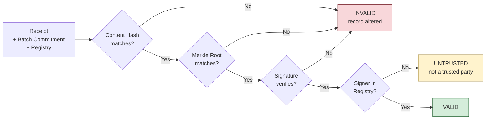
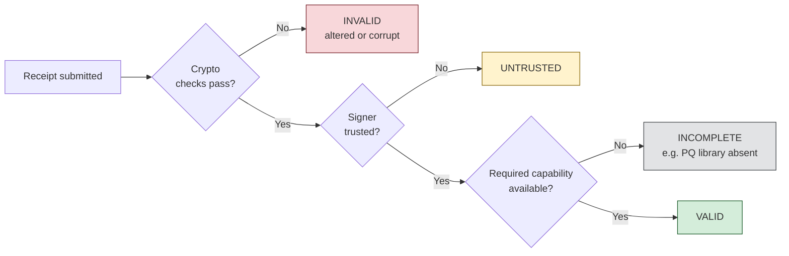
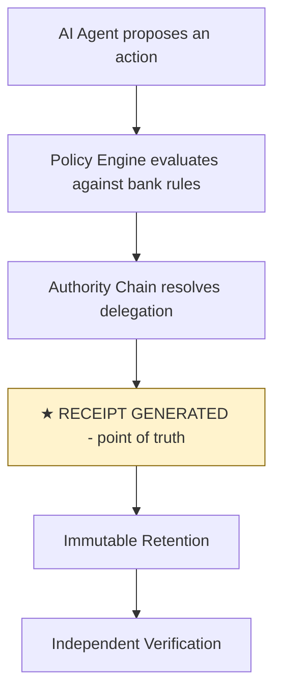
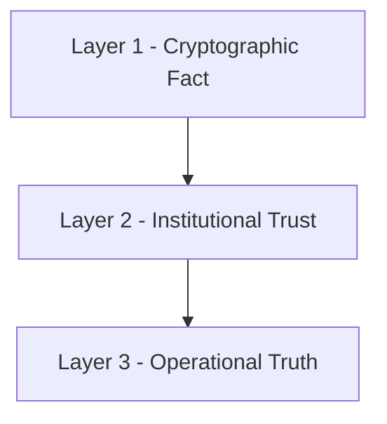
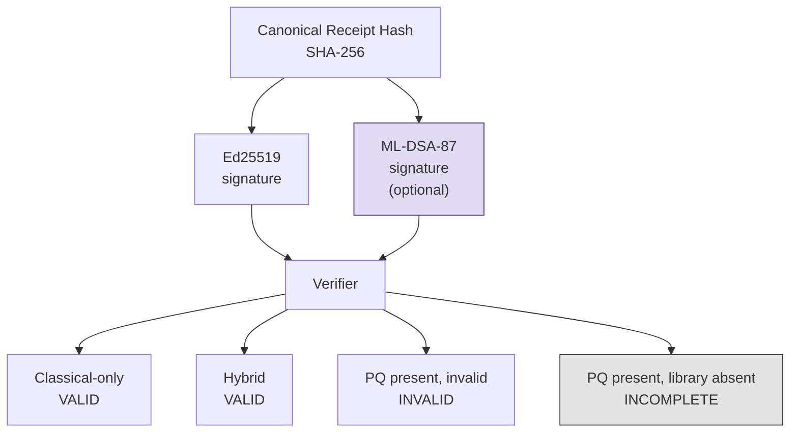
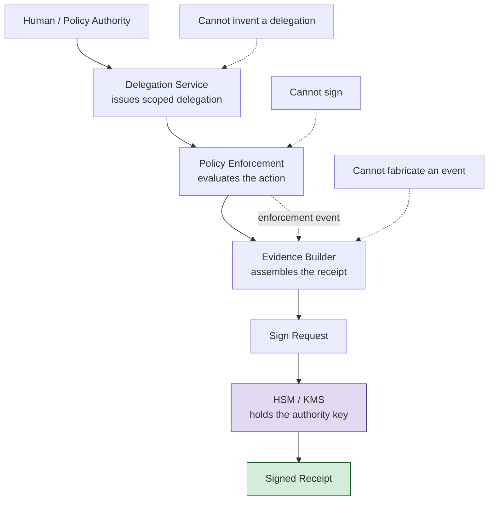

# Verifiable AI Action Records

**Cryptographic attribution and independent verification for AI agent decisions in regulated financial environments**

**A technical and business whitepaper**

---

## Executive Summary

A bank deploys AI agents to make consequential decisions — approve loans, flag transactions, execute trades within limits, process claims. When a regulator, an auditor, or opposing counsel asks *"who authorized this, and can you prove it?"*, the bank must answer.

Today, the answer is a log entry and an attestation. A third party cannot verify it independently, and the authorization chain — from a human principal to the acting agent — is usually reconstructed after the fact.

This paper describes a different approach: a cryptographically signed action record that an independent party verifies without accessing the bank's systems.

The central proposition is narrow:

> **A bank can produce a cryptographically verifiable record of an AI decision that an independent party can verify without accessing the bank's systems — and the bank controls the key.**

---

## Why a Financial Institution Cares

As AI agents move from recommendation to action, financial institutions need to demonstrate not only what an AI system did, but **which authority permitted the action, which constraints were applied, and whether the evidence can be independently trusted afterward**.

The operational value of a verifiable action record is not another audit log. It is a **portable evidence object at the point of authorization**.

For a financial institution, that provides five practical benefits:

1. **Faster assurance.** Auditors, investigators, and other authorized third parties can verify evidence without accessing the originating AI or application systems.

2. **Stronger attribution.** The action is cryptographically bound to an institution-controlled signing authority and an explicit delegation chain.

3. **Clearer investigations.** Verification distinguishes an altered record from a validly signed record produced by an untrusted authority — different failures with different remediation paths.

4. **Lower vendor dependency.** The bank controls the signing key, trust registry, retained evidence, and offline verifier — rather than depending on a vendor-hosted system to establish authenticity.

5. **Leverage of existing controls.** The receipt complements SIEM, WORM, IAM, HSM/KMS, GRC, and audit infrastructure rather than replacing them.

The result is a new assurance boundary around consequential AI actions: **the bank can produce evidence that remains independently verifiable outside the system that produced it.**

That is the reason to care. The cryptography is the mechanism; the institutional value is independently verifiable evidence of AI authorization and action.

---

## 1. The Problem: Attribution for Autonomous Actions

### 1.1 What Happens Today

When an AI agent acts inside a financial institution, the action is recorded in an application log. That entry typically contains the action type, a timestamp, the agent identifier, and an outcome. It is stored, shipped to a SIEM, and retained.

This is sufficient for **observability**. It is not sufficient for **attribution**.

### 1.2 Three Missing Properties

**Integrity.** A log entry can be modified after the fact — by an operator, a compromised process, or the application itself. Detecting that modification requires an external reference the log does not carry.

**Attribution.** A log records that an action occurred and which system produced it. It does not establish *who authorized it* — the delegation chain from a human principal to the acting agent.

**Verifiability.** Verifying a log requires access to the system that produced it, and trust that the system reports faithfully.

> Existing controls — signed logs, WORM retention, SIEM, HSM/KMS — establish integrity and retention *within the bank's control environment*. What they generally do not provide is a standardized, portable evidence object that an external party can independently verify *without access to those systems*.

### 1.3 Why This Is a Regulatory Problem

Financial institutions already have obligations that require attribution and tamper-evidence:

| Regulation | Requirement |
|---|---|
| **SR 11-7** (Federal Reserve) | Model risk management: reproducibility, effective challenge, independent validation |
| **EU AI Act, Article 14** | Human oversight of high-risk AI, with record-keeping |
| **MiFID II, RTS 6** | Annual validation of algorithmic systems; explainability of AI influence |
| **SEC Rule 17a-4** | Records retention with non-rewriteable, non-erasable storage |
| **DORA** | ICT third-party risk, resilience testing, audit rights |

Each is a mandate to *demonstrate something about an action*. Today they are satisfied with logs, manual processes, and attestations — which means the demonstration is only as strong as the institution's word.

**The gap this paper addresses:** a record format that carries the evidence, rather than requiring the institution to reconstruct it.

---

## 2. The Primitive: A Signed Action Record

### 2.1 What the Record Carries

The record — a VAP receipt — is a JSON object with six components:

| Component | Content |
|---|---|
| **Action** | What the agent attempted: type, input hash, metadata |
| **Decision** | The verdict: allow, block, defer |
| **Context** | The policy applied, the timestamp, the actor |
| **Constraints** | The rules evaluated, with their outcome |
| **Proof** | The cryptographic material: signature, Merkle root, signer key |
| **Authority** | The delegation chain from a human principal |

### 2.2 The Proof Block

```json
"proof": {
  "merkle_root": "8ac43a98e9f38ca6...",
  "merkle_path": ["af0e3dbbd3e2e58f..."],
  "signature": "73d814502935d908...",
  "signer_public_key": "18f6c91054d6a575...",
  "signature_algorithm": "Ed25519",
  "pq_signature": null,
  "pq_signer_public_key": null
}
```

The signature is Ed25519. The Merkle root commits to the record's content. The signer public key identifies the signing authority. The `pq_*` fields carry an optional post-quantum signature — see §6.

### 2.3 What Is Signed

The signature covers a deterministic canonical hash of the record body, excluding the proof block:

```
H = SHA256(CanonicalJSON(record_body))
```

Canonicalization sorts keys and uses compact separators, so the same logical record produces the same hash regardless of serialization order or absent fields. This was the subject of a canonicalization-parity fix — described in §12 — because the verifier and the signer must compute the hash identically, or valid receipts fail verification.

### 2.4 What the Record Does Not Carry

The record carries constraints — the rules applied and their outcomes. It does **not** carry the rationale for each constraint, or the counterfactual ("what would have been permitted instead"). These are the *legibility* fields, and they are a planned addition.

---

## 3. The Verification Model

### 3.1 Four Independent Checks

| Check | Question | Failure mode |
|---|---|---|
| **Content hash** | Does the body hash to the committed value? | The record was altered |
| **Merkle root** | Does the recomputed root match? | The record is not part of the claimed tree |
| **Signature** | Does the signature verify against the signer key? | The signature is corrupt or the key is wrong |
| **Registry** | Is the signer key in the trusted registry? | The signer is not a party the verifier trusts |



**These are independent.** A record can have a valid signature and an untrusted signer. It can have a valid hash and a corrupt signature. The verifier reports *which* check failed.

### 3.2 Why Specificity Matters

Most systems return a binary verdict. That is insufficient:

- **For an auditor:** "invalid" does not say whether the record was *altered* or *signed by an unauthorized party*. These have different remediation paths.
- **For a regulator:** the distinction between "the record is intact" and "the record is authorized" is the distinction between an evidentiary question and a governance question.

### 3.3 The Verification Outcomes

The verifier returns one of four results:

| Result | Meaning |
|---|---|
| `VALID` | All checks passed; the signer is trusted |
| `INVALID` | A cryptographic check failed — the record was altered, or a signature is corrupt |
| `UNTRUSTED` | Cryptography passed; the signer is not in the registry |
| `INCOMPLETE` | A required capability was unavailable — e.g., the post-quantum library is absent, or the batch commitment is missing |



**`INCOMPLETE` is distinct from `INVALID`.** A receipt whose post-quantum signature cannot be checked — because the library is absent — is not "invalid." It is "not fully verified." That distinction matters for an audit report, which should say which receipts carry which assurance.

### 3.4 The Trust Anchor

The verifier's trust anchor is a **root public key**, obtained out-of-band — not from the same channel as the receipt or the registry. This mirrors a certificate authority: the verifier obtains the root of trust through a channel it controls.

The registry itself is signed. A registry with an invalid signature is rejected before any receipt is verified.

**The trust boundary, stated explicitly:** the verifier trusts the root key it was given. Everything else is verified against that key.

---

## 4. The Demonstration

### 4.1 Setup

The demo generates a receipt through the API, then verifies it with a standalone tool. The tool runs in a clean-room environment with three dependencies (`cryptography`, `pymerkle`, `pydantic`) and no network access.

### 4.2 The Four Scenarios

| # | Scenario | What is modified |
|---|---|---|
| 1 | **Clean** | Nothing |
| 2 | **Body Tampered** | A field in the action |
| 3 | **Signature Corrupted** | The signature value only |
| 4 | **Untrusted Signer** | The signer key, re-signed with an unknown key |

### 4.3 Observed Results

```
Step 2: Verify independently (VALID)
Receipt:      VAP-20260913-AIDVU6-40BE
Hash Match:   ✅ VALID
Signature:    ✅ VALID
Signer:       a9143dfa34... -> Registry: Acme Bank
Authority:    ✅ Chain valid
Verdict:      VALID

Step 4: Verify again (INVALID)
Receipt:      VAP-20260913-AIDVU6-40BE
Hash Match:   ❌ INVALID (Tamper Detected)
Signature:    ❌ INVALID
Signer:       a9143dfa34... -> Registry: Acme Bank
Verdict:      INVALID

Step 4b: Corrupt Signature (INVALID)
Receipt:      VAP-20260913-AIDVU6-40BE
Hash Match:   ✅ VALID
Signature:    ❌ INVALID
Signer:       a9143dfa34... -> Registry: Acme Bank
Verdict:      INVALID

Step 5: Verify untrusted signer (UNTRUSTED)
Receipt:      VAP-20260913-AIDVU6-40BE
Hash Match:   ✅ VALID
Signature:    ✅ VALID
Signer:       3f15acaeed... -> ❌ UNTRUSTED
Verdict:      UNTRUSTED
```

### 4.4 The Results Table

| Scenario | Hash | Signature | Signer | Verdict |
|---|---|---|---|---|
| Clean | ✅ | ✅ | ✅ Trusted | **VALID** |
| Body Tampered | ❌ | ❌ | ✅ Trusted | **INVALID** |
| Signature Corrupted | ✅ | ❌ | ✅ Trusted | **INVALID** |
| Untrusted Signer | ✅ | ✅ | ❌ Untrusted | **UNTRUSTED** |

**The rows are distinct.** Row 3 shows the hash passing while the signature fails — the checks are independent. Row 4 shows both cryptographic checks passing while the registry fails — trust is separate from integrity.

### 4.5 Stability

| Run | Receipt ID | Signer |
|---|---|---|
| 1 | VAP-20260913-AIDPAR-C50E | `a9143dfa34...` |
| 2 | VAP-20260913-AIDIS8-145C | `a9143dfa34...` |
| 3 | VAP-20260913-AIDVU6-40BE | `a9143dfa34...` |

**The signer is stable.** It is the configured authority key, not a key generated per receipt. This is what makes the registry binding meaningful.

---

## 5. The Bank Architecture & Control Model

### 5.1 Where the Receipt Sits in the Decision Path

The receipt is generated at a defined point in the decision path — the **point of truth**.



### 5.2 What Each Assertion Proves — and Does Not Prove

| Assertion | What it proves | What it does **not** prove |
|---|---|---|
| Content hash matches | The record body is unchanged since signing | That the recorded action occurred |
| Signature verifies | The record was signed by the key holder | That the signer was authorized to sign |
| Signer is in registry | The signer is a party the verifier trusts | That the authorization chain is legally valid |
| Authority chain valid | Delegation resolves to a principal | That the principal had legal standing |
| Merkle root matches | The record belongs to the claimed tree | That the tree contains all relevant events |



*An administrator with both the signing key and the ability to invoke the enforcement path could fabricate a receipt. This is a key-governance problem, mitigated by separation of duties and audit of signing operations.*

### 5.3 The Point of Truth

The receipt is generated from the policy-enforcement event, before any downstream system can modify the result:

- The enforcement path produces the receipt synchronously with the verdict.
- The receipt is signed by the authority key at that moment.
- Downstream systems consume the receipt; they do not regenerate it.

**This architecture establishes the system's intended correspondence between the receipt and the enforcement event.** The security of that correspondence ultimately depends on the integrity and governance of the enforcement path.

---

## 6. Post-Quantum Signing — Optional and Crypto-Agile

### 6.1 The Capability

The receipt schema supports optional hybrid post-quantum signatures using **ML-DSA-87** (NIST FIPS 204, the highest security category of the ML-DSA standard).

When enabled, a receipt carries both an Ed25519 signature and an ML-DSA-87 signature over the same canonical hash. **The verifier checks both.**

### 6.2 Why It Matters for Long-Lived Evidence

A bank may retain an AI decision receipt for 5–10 years. The question is not only *"is this signature secure today?"* but *"will this signature remain trustworthy when the record is examined years from now?"*

ML-DSA-87 provides post-quantum security at the signature layer — the assurance that the signature cannot be forged by an adversary with a large-scale quantum computer.

### 6.3 The Scope of the Claim

**The signature layer provides post-quantum security.** It does not make the entire evidence system quantum-resistant:

- SHA-256, the Merkle construction, and the canonicalization remain part of the assurance chain
- The registry, the trust anchor, and the HSM/KMS remain part of the chain
- The enforcement path — and its governance — remains part of the chain

The accurate claim is: *the signature layer can provide post-quantum security using ML-DSA-87.*

### 6.4 Crypto-Agility

The evidence format separates the evidence object from the signature algorithm. This allows an institution to:

- Maintain multiple cryptographic assurances over the same evidence commitment
- Transition signature algorithms without changing the evidence model
- Adopt post-quantum signing on its own schedule, per policy or per action class

**The evidence object is unchanged whether post-quantum signing is enabled or not.** That is what allows the transition to be a configuration decision, not a migration.

### 6.5 The Operational Model

Post-quantum signing is **off by default**. It is enabled by configuring the post-quantum key pair. When the keys are absent, receipts are signed with Ed25519 only, and the `pq_*` fields remain `null`.

The verifier distinguishes three outcomes:

| Receipt state | Verifier behavior |
|---|---|
| `pq_signature` present and valid | ✅ Post-quantum verified |
| `pq_signature` present and invalid | ❌ `INVALID` — the check fails |
| `pq_signature` absent (disabled) | ⚪ Classical-only — not a failure |
| `pq_signature` present, library unavailable | ⚠️ `INCOMPLETE` — the check is skipped, not failed |

**The fourth row is the audit-ready distinction.** A missing library is an operational condition, not a cryptographic failure.

### 6.6 Size

An ML-DSA-87 signature is ~4,627 bytes — roughly 4.6 KB. For a bank's scale, the storage cost is negligible; the trade-off is a larger receipt when the capability is enabled. **Because the capability is optional, an institution enables it only where its crypto policy requires it.**



---

## 7. Key Governance

### 7.1 The Questions a Security Review Will Ask

| Question | Answer |
|---|---|
| **Who owns the key?** | The institution — a named legal entity, business unit, and environment |
| **Where is it held?** | The bank's KMS/HSM. Never in the vendor's environment. |
| **Who can authorize signing?** | A defined role, with documented separation of duties |
| **Who can rotate it?** | A documented process, with a defined rotation period |
| **Who can revoke it?** | Via the registry; a revoked key produces `UNTRUSTED` |
| **What happens on compromise?** | The system fails closed; the key is revoked |
| **What happens when an employee leaves?** | Access to the signing authorization is revoked |

### 7.2 The Critical Distinction

The cryptographic statement *"this record was signed by the institution"* is **not automatically equivalent** to *"this action was genuinely authorized by the institution."*

The architecture must establish that relationship:

- The receipt is generated from the enforcement event, not constructed independently.
- The signing key is held by a role that does not have the ability to fabricate enforcement events.
- Signing operations are themselves audited.



**The system fails closed** — it will not sign without the configured authority key, and it will not generate an ephemeral key as a fallback. This is what makes the signer attributable to an institution-controlled signing authority.

---

## 8. Why This Is Different From Existing Immutable Logs

### 8.1 What the Bank Already Has

A bank already operates SIEM for detection, WORM / immutable storage for retention, IAM for access control, HSM/KMS for key management, GRC for compliance tracking, and database audit trails.

**These are not inadequate. They serve their purposes well.**

### 8.2 The Distinction

| Existing control | What it provides | What it does not provide |
|---|---|---|
| SIEM | Detection inside the bank | Portable evidence for an external party |
| WORM / immutable storage | Non-rewriteable retention | Independent verification without system access |
| Audit logs | A record of system activity | Attribution to an authorizing principal |
| IAM | Access control | Proof of delegation to an agent |
| GRC | Compliance tracking | Cryptographic evidence of a specific action |

**Existing controls establish what the bank's systems *say* happened.** The receipt produces a portable cryptographic evidence object that an independent party verifies *without accessing those systems*.

### 8.3 The Commercial Positioning

The receipt's differentiator is **not integrity** — the bank already has that. It is **independent verifiability**.

The bank's existing controls prove things *to the bank*. The receipt proves things *to a third party*.

---

## 9. Potential Control Contributions — Subject to Institutional Assessment

The receipt provides **evidence**. Whether it **satisfies** an obligation is the institution's determination.

| Obligation | What the receipt contributes |
|---|---|
| **Model risk (SR 11-7)** | Evidence that a decision can be independently re-verified |
| **AI oversight (EU AI Act Art. 14)** | Evidence of the delegation chain and the human principal |
| **Operational resilience (DORA)** | Evidence that the auditor verifies independently, without vendor dependency |

*Similar correspondences apply to MiFID II RTS 6 and SEC Rule 17a-4.*

> *The regulatory mappings in this section are illustrative control correspondences, not legal interpretations. The institution remains responsible for determining whether the evidence contributes to a specific compliance demonstration, in consultation with its counsel and its regulator.*

---

## 10. The Product: Why VeriLinkOS

### 10.1 The Build-It-Yourself Question

A bank could theoretically implement canonical JSON, SHA-256, Ed25519, a Merkle tree, an HSM integration, and a Python verifier — and ask: *"What is the product?"*

### 10.2 The Answer

The product is the **operational system around the primitive**:

| Component | What it is |
|---|---|
| **Standardized evidence format** | The receipt schema — so a receipt from one system is verifiable by another |
| **Authority and delegation model** | The chain from a human principal to an agent |
| **Signing infrastructure integration** | KMS/HSM integration, key lifecycle, fail-closed behavior |
| **Registry management** | Mapping keys to organizations, with rotation and revocation |
| **Independent verifier** | The offline tool the auditor runs — clean-room, three dependencies |
| **SIEM/GRC integration** | Receipts flow into the bank's existing tooling |
| **Audit evidence packaging** | A set of receipts with a verifiable chain |

**The cryptography is the foundation. The product is the machinery that makes it operable in a bank's environment.**

### 10.3 The Strongest Positioning

> **The bank controls the trust decisions. VeriLinkOS provides the format and the machinery.**

- The bank holds the signing key.
- The bank defines the registry.
- The bank runs the verifier.
- The bank determines who is trusted.

### 10.4 The Vendor-Risk Answer

If VeriLinkOS disappeared tomorrow:

- The bank's existing receipts would still verify.
- The verifier is offline, with three dependencies.
- The registry and root key are the bank's.

**For a third-party risk committee, that is a materially different posture than a hosted dashboard.**

---

## 11. The Bank's Evaluation Path

| Stage | What the bank evaluates | What this paper provides |
|---|---|---|
| **Architecture review** | Does the primitive make sense? | §2, §3 |
| **Security review** | Is key management sound? | §7 |
| **AI governance review** | Which decisions should produce receipts? | §9 |
| **Legal / compliance** | What evidentiary value does this have? | §9 (the caveat) |
| **Vendor risk** | What happens if VeriLinkOS disappears? | §10.4 |
| **Pilot** | Can it deploy on one workflow? | §12 |
| **Audit validation** | Can internal audit use the evidence? | §4 |
| **Production** | Can it operate at scale? | §13.2 |

---

## 12. Deployment Realities

| Requirement | What it means |
|---|---|
| **Key governance** | The private key in HSM, with documented access control and rotation |
| **Clock synchronization** | MiFID II RTS 25 requires microsecond precision |
| **Latency budgets** | The enforcement path adds verification time; determines inline vs. asynchronous |
| **Integration** | Receipts flow into SIEM and GRC tooling; the verifier embeds in the audit pipeline |
| **Regulatory engagement** | Before claiming admissibility, a specific regulator pilot |

**None of these are protocol changes.** They are deployment work, and they are the bank's.

**A note on the canonicalization-parity fix:** during development, the signing path and the verification path computed the canonical hash differently — one included `None` fields, the other omitted them; one serialized enums as strings, the other as their repr. This produced receipts the API verified but the standalone tool rejected. The fix was to centralize the hash computation and normalize `None` and enums at the function level. **It is noted here because it is the class of defect that produces silent verification failures** — a signature that verifies in one implementation and not another.

---

## 13. Questions and Limitations

### 13.1 Questions a Technical Evaluator Will Ask

**Q: Who holds the signing key?** The institution. The system refuses to sign without it.

**Q: Is the record court-admissible?** The record is cryptographically tamper-evident and attributable to an institution-controlled signing authority. Whether a specific court accepts the format is a legal determination.

**Q: What happens if the key is compromised?** The system fails closed. Revocation is via the registry.

**Q: Does the auditor need to trust VeriLinkOS?** No. The verifier runs offline, with three dependencies, in the evaluator's environment.

**Q: How do I know the receipt corresponds to reality?** The cryptography proves the record is intact and attributable. The correspondence to reality depends on the point-of-truth architecture and the governance of the enforcement path.

**Q: Is post-quantum signing required?** No. It is optional. When enabled, the verifier checks it; when disabled, the classical signature is the sole cryptographic assurance.

### 13.2 What the System Does Not Do

| Limitation | Status |
|---|---|
| **Legibility: rationale and counterfactual** | Constraints are recorded; the rationale and counterfactual are a planned addition |
| **Incident model reconciliation** | The forensic endpoint uses a different incident model than the incidents API; deferred |
| **Regulatory acceptance** | No regulator or court has accepted the format as evidence |
| **Production hardening at scale** | The demonstration is a primitive proof; latency, clock sync, and integration are deployment work |

---

## 14. The Evaluation Path

A technical evaluator can reproduce the demonstration:

1. Generate a receipt through the API
2. Run the standalone verifier against it
3. Tamper the record, verify again
4. Corrupt the signature, verify again
5. Re-sign with an unknown key, verify again

The expected outputs are the four rows in §4.4. **If the outputs match, the properties hold.**

The verifier runs offline, with three dependencies, in the evaluator's own environment. No vendor contact is required.

---

## 15. Conclusion

The question this paper addresses is narrow:

> Can an AI agent action be recorded so that an independent party verifies — offline, without accessing the producer's systems — what happened, who authorized it, and that the record wasn't altered?

The demonstration shows that it can. Four scenarios, four distinct verdicts. A verifier with three dependencies and no network. A signer stable across runs. A trust anchor controlled by the verifier.

The system does not claim to satisfy a regulation, be court-admissible, or be production-hardened at scale. Those are determinations for the institution, its counsel, and its regulators.

What it does claim is narrower and checkable:

> **A signed, tamper-evident record that an independent party verifies without accessing the bank's systems, and a verifier that distinguishes tampering from untrusted authorship — with optional post-quantum signing for long-lived evidence.**

For a financial institution, the consequence is concrete:

> **The bank produces a record of an AI decision that an independent party verifies without accessing the bank's systems — and the bank controls the key that binds it to the institution's signing authority.**

That is the primitive. The architecture, the key governance, and the deployment work are built on it.

---

*The demonstration and verifier are reproducible. The evidence in §4 is actual output, not illustration.*', file_path: